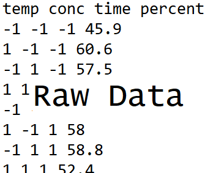
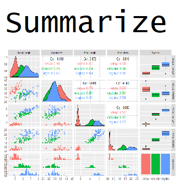

```{r setup, echo = FALSE, message = FALSE, warning = FALSE}
library(tidyverse)
options(dplyr.print_min = 5)
knitr::opts_chunk$set(echo = FALSE, eval = TRUE, message = FALSE, warning = FALSE)
```


## What is this course about?

Basic use of R for reading, manipulating, and plotting data!


## What is this course about?

Basic use of R for reading, manipulating, and plotting data!

<div style = "float: left;border:1px solid black;">
<a href = "https://www4.stat.ncsu.edu/~online/datasets/chemical.txt">
```{r step1a, fig.align = 'left', out.width = '205px', out.height = "249px"}

```
</a>
</div>

## What is this course about?

Basic use of R for reading, manipulating, and plotting data!

<div style = "float: left;border:1px solid black;">
<a href = "https://www4.stat.ncsu.edu/~online/datasets/chemical.txt">
```{r step2a, fig.align = 'left', out.width = '205px', out.height = "249px"}

```
</a>
</div>
<div style = "float: left;">
```{r arrow2a, fig.align = 'left', out.width = '30px', out.height = "249px"}

```
</div>
<div style = "float: left;border:1px solid black;">
<a href = "https://www4.stat.ncsu.edu/~online/datasets/readChemData.r">
```{r step2b, fig.align = 'left', out.width = '205px', out.height = "249px"}
knitr::include_graphics("../img/ImportR.png")
```
</a>
</div>


## What is this course about?

Basic use of R for reading, manipulating, and plotting data!

<div style = "float: left;border:1px solid black;">
<a href = "https://www4.stat.ncsu.edu/~online/datasets/chemical.txt">
```{r step3a, fig.align = 'left', out.width = '205px', out.height = "249px"}

```
</a>
</div>
<div style = "float: left;">
```{r arrow3a, fig.align = 'left', out.width = '30px', out.height = "249px"}

```
</div>
<div style = "float: left;border:1px solid black;">
<a href = "https://www4.stat.ncsu.edu/~online/datasets/readChemData.r">
```{r step3b, fig.align = 'left', out.width = '205px', out.height = "249px"}
knitr::include_graphics("../img/ImportR.png")
```
</a>
</div>
<div style = "float: left;">
<a href = "https://www4.stat.ncsu.edu/~online/datasets/summChemData.r">
```{r arrow3b, fig.align = 'left', out.width = '30px', out.height = "249px"}

```
</a>
</div>
<div style = "float: left;border:1px solid black;">
<a href = "https://www4.stat.ncsu.edu/~online/datasets/summChemData.r">
```{r step3c, fig.align = 'left', out.width = '205px', out.height = "249px"}

```
</a>
</div>


## What is this course about?

Basic use of R for reading, manipulating, and plotting data!

<div style = "float: left;border:1px solid black;">
<a href = "https://www4.stat.ncsu.edu/~online/datasets/chemical.txt">
```{r step4a, fig.align = 'left', out.width = '205px', out.height = "249px"}

```
</a>
</div>
<div style = "float: left;">
```{r arrow4a, fig.align = 'left', out.width = '30px', out.height = "249px"}

```
</div>
<div style = "float: left;border:1px solid black;">
<a href = "https://www4.stat.ncsu.edu/~online/datasets/readChemData.r">
```{r step4b, fig.align = 'left', out.width = '205px', out.height = "249px"}
knitr::include_graphics("../img/ImportR.png")
```
</a>
</div>
<div style = "float: left;">
```{r arrow4b, fig.align = 'left', out.width = '30px', out.height = "249px"}

```
</div>
<div style = "float: left;border:1px solid black;">
<a href = "https://www4.stat.ncsu.edu/~online/datasets/summChemData.r">
```{r step4c, fig.align = 'left', out.width = '205px', out.height = "249px"}

```
</a>
</div>
<div style = "float: left;">
```{r arrow4c, fig.align = 'left', out.width = '30px', out.height = "249px"}

```
</div>
<div style = "float: left;border:1px dashed black;">
```{r step4d, fig.align = 'left', out.width = '205px', out.height = "249px"}
knitr::include_graphics("../img/AnalysisR.png")
```
</div>


## What is this course about?

Basic use of R for reading, manipulating, and plotting data!

- **read and write basic R programs**   
- import well formatted data into R
- do basic data manipulation in R   
- produce common numerical and graphical summaries in R  
- describe a use case of an analysis done in R  


## Where do we start?  


- Install R/RStudio  
    + Module 0!  
    
<!-- > - Write code using proper **syntax** 
Submit to be evaluated by R
Save, print, or embed results directly in a report!-->  

> - RStudio IDE (Integrated Development Environment)  

> - R Objects and Classes  

> - Data Objects & Basic Manipulation    


## RStudio IDE 

In RStudio, four main 'areas'   

- Console (& Terminal)  

- Scripting and Viewing Window  
    
- Plots/Help (& Files/Packages)  

- Environment (& Connections/Git)  
    


## Console  

- Type code directly into the **console** for evaluation  

<div  style = "float: left; width = 45%;">
```{r calc2, echo=TRUE}
#simple math operations
# <-- is a comment - code not evaluated
3 + 7
10 * exp(3) #exp is exponential function
log(pi^2) #log is natural log by default
```
</div>

<div  style = "float: right; width = 45%;">
```{r basic, echo = TRUE, out.width = "400px", fig.align='center'}
mean(cars$speed)
hist(cars$speed)
```
</div>
<!--Output of each of these is actually a vector of length 1!-->

## Scripting and Viewing Window 

- Usually want to keep code for later use!  

> - Write code in a 'script' and save script (or use markdown - covered later)

> - From script can send code to console via: 
    <ul>
      <li> "Run" button (runs current line)  </li>
      <li> CTRL+Enter (PC) or Command+Enter (MAC)  </li>
      <li> Highlight section and do above</li>
    </ul>

## Scripting and Viewing Window  

- Go to file --> New File --> R Script  

- Type `View(cars)` (note capital `V`)  

- Type `plot(cars)`  

- Submit to console using button or hot key  


## Plots/Help 

+ Created plots stored in `Plots` tab  

    - Cycle through past plots  
    - Easily save  
 
> + `Help` tab to learn about R functions  
    - Type `help(hist)` in the console

## Environment   

- Store **data/info/function/etc.** in R objects  

- Create an R object via `<-` (recommended) or `=`  

```{r save,echo=TRUE}
#save for later
avg <- (5 + 7 + 6) / 3
#call avg object
avg
#strings (text) can be saved as well
words <- c("Hello there!", "How are you?")
words
```


## Environment   

- Look at all current objects with `ls()`

```{r ls, echo = TRUE}
ls()
```

- `rm()` to remove  

```{r rm, echo = TRUE}
rm(avg)
ls()
```


## Environment   

- Built-in objects exist like `letters` and `cars`  

```{r builtin, echo = TRUE}
letters
head(cars, n = 3)
```

- `data()` shows available built-in datasets


## RStudio IDE 

Four main 'areas'   

- Console (& Terminal)  

- Scripting and Viewing Window  
    
- Plots/Help (& Files/Packages)  

- Environment (& Connections/Git)  
    

## RStudio IDE 

To rearrange panes

```{r panes, out.width = "700px",echo=FALSE, fig.align = "center"}
knitr::include_graphics("../img/panes.png")
```


## RStudio IDE 

Other useful global options:  

- Appearance  

    + font size  
    + theme  
    
- Code  
 
    + editing --> soft-wrap  
    + display --> show whitespace


    
## R Objects and Classes  

- R has strong **O**bject **O**riented **P**rogramming (OOP) tools  

- Object: data structure with attributes (class)  

- Method: procedures (functions) act on object based on attributes  


## R Objects and Classes  

- R has strong **O**bject **O**riented **P**rogramming (OOP) tools  

- Object: data structure with attributes (class)  

- Method: procedures (functions) act on object based on attributes  

- R functions like `print()` or `plot()` act differently depending on object class 

<div style = "float: left; width = 45%;">
```{r str1, echo = TRUE}
class(cars)
```
</div>
<div style = "float: left; width = 10%;">
&nbsp;&nbsp;&nbsp;&nbsp;&nbsp;&nbsp;&nbsp;&nbsp;&nbsp;&nbsp;&nbsp;
</div>
<div style = "float: left; width = 45%;">
```{r str2, echo = TRUE}
class(exp)
```
</div>


## R Objects and Classes  

- R has strong **O**bject **O**riented **P**rogramming (OOP) tools  

- Object: data structure with attributes (often a 'class')  

- Method: procedures (often 'functions') act on object based on attributes  

- R functions like `print()` or `plot()` act differently depending on object class 

<div style = "float: left; width = 45%;">
```{r plot1, echo = TRUE, fig.align = 'center', out.width = '350px'}
plot(cars)
```
</div>
<div style = "float: left; width = 10%;">
&nbsp;&nbsp;&nbsp;&nbsp;&nbsp;&nbsp;&nbsp;&nbsp;&nbsp;&nbsp;&nbsp;&nbsp;&nbsp;&nbsp;&nbsp;&nbsp;&nbsp;&nbsp;&nbsp;&nbsp;&nbsp;&nbsp;

</div>
<div style = "float: left; width = 45%;">
```{r plot2, echo = TRUE, fig.align = 'center', out.width = '350px'}
plot(exp)
```
</div>


## R Objects and Classes  

- Create an R object via `<-` (recommended) or `=`  

    + allocates memory to object  
    
    + object attributes usually depend on how you created it!  
    
```{r create, echo = TRUE}
vec <- c(1, 4, 10)
class(vec)

fit <- lm(dist ~ speed, data = cars)
class(fit)
```


## Investigating Objects  

Many functions to help understand an R Object  

 - `class()`  
 
 - describes the `class` attribute of an R object  
 
```{r obj2, echo = TRUE}
class(cars)
```


## Investigating Objects  

Many functions to help understand an R Object  

 - `typeof()`  
 
 - determines the (R internal) type or storage mode of any object  
 
```{r obj3, echo = TRUE}
typeof(cars)
```
 
## Investigating Objects  

Many functions to help understand an R Object  

 - `str()`  
 
 - compactly displays the internal structure of an R object  
 
```{r obj1, echo = TRUE}
str(cars)
```


## Recap & What's next?!  

Create an R Object with `<-`  

Many functions to help understand an R Object  

 - `class()`  
 - `typeof()`
 - `str()`  

## Recap & What's next?!  

Create an R Object with `<-`  

Many functions to help understand an R Object  

 - `class()`  
 - `typeof()`
 - `str()`  

Common data structures  

1. Atomic Vector (1d)  
2. Matrix (2d)  
3. Array (nd) (not covered)  
4. Data Frame (2d)  
5. List (1d)  
