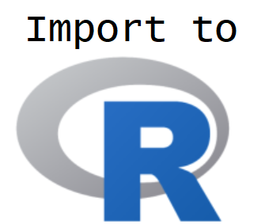

```{r setup, echo = FALSE, message = FALSE, warning = FALSE}
library(tidyverse)
library(haven)
options(dplyr.print_min = 5)
options(tibble.print_min = 5)
library(knitr)
opts_chunk$set(message = FALSE, cache = TRUE, warning = FALSE)
```


## What is this course about?

Basic use of R for reading, manipulating, and plotting data!

<div style = "float: left;border:1px solid black;">
<a href = "https://www4.stat.ncsu.edu/~online/datasets/chemical.txt">
```{r step4a, fig.align = 'left', out.width = '205px', out.height = "249px", eval = TRUE, echo = FALSE}
knitr::include_graphics("../img/rawData.png")
```
</a>
</div>
<div style = "float: left;">
```{r arrow4a, fig.align = 'left', out.width = '30px', out.height = "249px", eval = TRUE, echo = FALSE}
knitr::include_graphics("../img/arrow.png")
```
</div>
<div style = "float: left;border:1px solid black;">
<a href = "https://www4.stat.ncsu.edu/~online/datasets/readChemData.r">
```{r step4b, fig.align = 'left', out.width = '205px', out.height = "249px", eval = TRUE, echo = FALSE}

```
</a>
</div>
<div style = "float: left;">
```{r arrow4b, fig.align = 'left', out.width = '30px', out.height = "249px", eval = TRUE, echo = FALSE}
knitr::include_graphics("../img/arrow.png")
```
</div>
<div style = "float: left;border:1px solid black;">
<a href = "https://www4.stat.ncsu.edu/~online/datasets/summChemData.r">
```{r step4c, fig.align = 'left', out.width = '205px', out.height = "249px", eval = TRUE, echo = FALSE}
knitr::include_graphics("../img/SummarizeR.png")
```
</a>
</div>
<div style = "float: left;">
```{r arrow4c, fig.align = 'left', out.width = '30px', out.height = "249px", eval = TRUE, echo = FALSE}
knitr::include_graphics("../img/arrow.png")
```
</div>
<div style = "float: left;border:1px dashed black;">
```{r step4d, fig.align = 'left', out.width = '205px', out.height = "249px", eval = TRUE, echo = FALSE}
knitr::include_graphics("../img/AnalysisR.png")
```
</div>


## What is this course about?

Basic use of R for reading, manipulating, and plotting data!

- read and write basic R programs   
- **import well formatted data into R**
- do basic data manipulation in R   
- produce common numerical and graphical summaries in R  
- describe a use case of an analysis done in R  


## Where do we start?  

- Common raw data formats  

> - Comma Separated Value (CSV) files

> - Asides: R projects and R packages

> - Read 'clean' delimited data

> - Excel, SAS, & SPSS data  

> - Resources for JSON, XML, databases, and APIs


## Importing Data  
**How to read in data depends on raw/external data type!**  

- Lecture focus: Delimited data  

     + Delimiter - Character (such as a `,`) that separates data entries

<div style = "float: left;border:1px solid black;">
<a href = "https://www4.stat.ncsu.edu/~online/datasets/neuralgia.csv">
```{r csv, fig.align = 'left', out.width = '205px', out.height = "249px", eval = TRUE, echo = FALSE}
knitr::include_graphics("../img/commaDelim.png")
```
</a>
</div>
<div style = "float: left;">
&nbsp;&nbsp;
</div>
<div style = "float: left;border:1px solid black;">
<a href = "https://www4.stat.ncsu.edu/~online/datasets/chemical.txt">
```{r space, fig.align = 'left', out.width = '205px', out.height = "249px", eval = TRUE, echo = FALSE}
knitr::include_graphics("../img/spaceDelim.png")
```
</a>
</div>
<div style = "float: left;">
&nbsp;&nbsp;
</div>
<div style = "float: left;border:1px solid black;">
<a href = "https://www4.stat.ncsu.edu/~online/datasets/crabs.txt">
```{r tab, fig.align = 'left', out.width = '205px', out.height = "249px", eval = TRUE, echo = FALSE}
knitr::include_graphics("../img/tabDelim.png")
```
</a>
</div>
<div style = "float: left;">
&nbsp;&nbsp;
</div>
<div style = "float: left;border:1px solid black;">
<a href = "https://www4.stat.ncsu.edu/~online/datasets/umps2012.txt">
```{r general, fig.align = 'left', out.width = '205px', out.height = "249px", eval = TRUE, echo = FALSE}
knitr::include_graphics("../img/generalDelim.png")
```
</a>
</div>
<div style = "clear:both; font-size: 10pt;">
&nbsp;&nbsp;&nbsp;&nbsp;&nbsp;&nbsp;&nbsp;**Comma:** usually .csv &nbsp;&nbsp;&nbsp;&nbsp;&nbsp;&nbsp;&nbsp;&nbsp;&nbsp;&nbsp;&nbsp;&nbsp;&nbsp;&nbsp;&nbsp;&nbsp;&nbsp;&nbsp;&nbsp;&nbsp;&nbsp;&nbsp;&nbsp;&nbsp;&nbsp;&nbsp;&nbsp;&nbsp;
**Space:** usually .txt or .dat &nbsp;&nbsp;&nbsp;&nbsp;&nbsp;&nbsp;&nbsp;&nbsp;&nbsp;&nbsp;&nbsp;&nbsp;&nbsp;&nbsp;&nbsp;&nbsp;&nbsp;&nbsp;&nbsp;&nbsp;
**Tab:** usually .tsv or .txt  &nbsp;&nbsp;&nbsp;&nbsp;&nbsp;&nbsp;&nbsp;&nbsp;&nbsp;&nbsp;&nbsp;&nbsp;&nbsp;&nbsp;&nbsp;&nbsp;&nbsp;&nbsp;&nbsp;&nbsp;&nbsp;&nbsp;&nbsp;
**General:** usually .txt or .dat
</div>


## Importing Delimited Data: Standard R Methods

 - When you open R a few `packages` are loaded
 
> - R package  
    <ul>
      <li> Collection of functions/datasets/etc. in one place</li>  
      <li> Packages exist to do almost anything</li>  
      <li> [List of CRAN](https://cran.r-project.org/web/packages/available_packages_by_name.html) approved packages on R's website</li>  
      <li> Plenty of other packages on places like GitHub</li>
    </ul>


## Importing Delimited Data: Standard R Methods

 - When you open R a few `packages` are loaded
 
```{r loadR, fig.align = 'center', out.width = "250px", echo = FALSE}
include_graphics("../img/loadR.png")
```

 - `utils` package has *family* of `read.` functions ready for use!  
 
 
## Importing Delimited Data: Standard R Methods

Function and purpose:

Type of Delimeter           | Function   
--------------------------- | -----------------
Comma                       | `read.csv()`
Semicolon (`,` for decimal) | `read.csv2()`
Tab                         | `read.delim()`
White Space/General         | `read.table(sep = "")`  


> - Each function requires a **path** to the file  


## Reading a .csv File  

- Let's read in the '[neuralgia.csv](https://www4.stat.ncsu.edu/~online/datasets/neuralgia.csv)' file  

- How does R locate the file?  


## Path to File   

- Let's read in the '[neuralgia.csv](https://www4.stat.ncsu.edu/~online/datasets/neuralgia.csv)' file  

- How does R locate the file?  

    + Can give *full path name*  
    
        * ex: C:/Users/jbpost2/repos/camp/modules/12-R-basics/datasets/neuralgia.csv  
        * ex: C:\\\\Users\\\\jbpost2\\\\repos\\\\camp\\\\modules\\\\12-R-basics\\\\datasets\\\\neuralgia.csv  

```{r pathVis, fig.align = 'center', out.width = "450px", echo = FALSE}
knitr::include_graphics("../img/pathVis.png")
```


## Reading a .csv File  

- Let's read in the '[neuralgia.csv](https://www4.stat.ncsu.edu/~online/datasets/neuralgia.csv)' file  

- Use full local path  

```{r readCSVhidden, echo = FALSE, eval = TRUE}
neuralgiaData <- read.csv("https://www4.stat.ncsu.edu/~online/datasets/neuralgia.csv")
```

```{r readCSV, echo = TRUE, eval = FALSE}
neuralgiaData <- read.csv(
           "C:/Users/jbpost2/repos/camp/modules/12-R-basics/datasets/neuralgia.csv"
           )
```

```{r printCSV}
head(neuralgiaData)
```


## Working Directory  

- Let's read in the '[neuralgia.csv](https://www4.stat.ncsu.edu/~online/datasets/neuralgia.csv)' file  

- Using full local path not recommended!  

    + Can't share code without changing path...
    
    

## Working Directory  

- Let's read in the '[neuralgia.csv](https://www4.stat.ncsu.edu/~online/datasets/neuralgia.csv)' file  

- Using full local path not recommended!  

    + Can't share code without changing path...
    
- Can change *working directory*  
<ul>
    <li> Folder where R 'looks' for files</li>
    <li> Supply **relative** path </li>
</ul>


## Working Directory  

- Let's read in the '[neuralgia.csv](https://www4.stat.ncsu.edu/~online/datasets/neuralgia.csv)' file  

- Using full local path not recommended!  

    + Can't share code without changing path...
    
- Can change *working directory*  
<ul>
    <li> Folder where R 'looks' for files</li>
    <li> Supply **relative** path </li>
</ul>

```{r getwd}
getwd()
```


## Working Directory  

- Can change *working directory*  

    + Via code

```{r setwd1,eval=FALSE}
setwd("C:/Users/jbpost2/repos/camp/modules/12-R-basics/datasets")
#or
setwd("C:\\Users\\jbpost2\\repos\\camp\\modules\\12-R-basics\\datasets")
```
<!--Double slash needed because \ is an escape character in R so \\ is really read as \-->


## Working Directory  

- Can change *working directory*  

    + Via code
 
    + Via menus

```{r setwd2, out.width = "800px",echo=FALSE}
knitr::include_graphics("../img/setwd.png")
```


## Reading a .csv File  

- Let's read in the '[neuralgia.csv](https://www4.stat.ncsu.edu/~online/datasets/neuralgia.csv)' file  

- Use relative path (`../` drops down a folder)

```{r readCSVrel, eval = FALSE}
neuralgiaData <- read.csv("../datasets/neuralgia.csv")
```

- Working directory: ".../12-R-basics/Module2_ImportingData"

- File location: ".../12-R-basics/datasets/neuralgia.csv

> - As long others have the same folder structure, can share code with no path change needed!


## Reading a .csv File  

- Let's read in the '[neuralgia.csv](https://www4.stat.ncsu.edu/~online/datasets/neuralgia.csv)' file  

- R can pull from URLs as well!

```{r readCSV2, eval = TRUE}
neuralgiaData <- read.csv("https://www4.stat.ncsu.edu/~online/datasets/neuralgia.csv")
head(neuralgiaData)
```


## Reading a .csv File  

`read.csv()` function 

Tell R where the file lives via:  

<ul>
  <li> a full local path (not recommended)  </li>
  <li> a relative path  </li>
  <ul>
    <li> can set the working directory with `setwd()`  </li>
  </ul>
  <li> pulling from URL</li>
</ul>


## Aside: RStudio Project

- Often have many files associated with an analysis  

- With multiple analyses things get cluttered...  


## Aside: RStudio Project

- Often have many files associated with an analysis  

- With multiple analyses things get cluttered...  

- Want to associate different  
<ul>
   <li> environments </li>
   <li> histories </li>
   <li> working directories </li>
   <li> source documents </li>
</ul> 
with each analysis

> - Can use "Project" feature in R Studio  


## Aside: RStudio - Project

- Easy to create!  Use an existing folder or create one:

```{r project.png, out.width = "600px",echo=FALSE, fig.align = 'center'}
knitr::include_graphics("../img/project.png")
```

- Easily switch between analyses!  

- Create one for today's lesson  

- Swap between projects using menu in top right


## Reading Delimited Data  

- Functions from `read.` family work well  

- Concerns:  

    + (formerly, prior to R 4.0) poor default function behavior
    
         * strings were read as `factors`  


## Reading Delimited Data  

- Functions from `read.` family work well  

- Concerns:  

    + poor default function behavior
    
         * (formerly, prior to R 4.0) strings are read as `factors`  
         
         * row & column names can be troublesome
    
    + Slower processing  
    
    + (Slightly) different behavior on different computers  
    


## Aside: R Packages

- R package  
    <ul>
      <li> Collection of functions in one place</li>  
      <li> Packages exist to do almost anything</li>  
      <li> [List of CRAN](https://cran.r-project.org/web/packages/available_packages_by_name.html) approved packages on R's website</li>  
      <li> Plenty of other packages on places like GitHub</li>
    </ul>
    
> - "[TidyVerse](http://tidyverse.org/)" - collection of R packages that share common philosophies and are designed to work together!  
<!--Many packages do the same thing.  Some just do it better than others.  Often hard to pick the best one.-->    


## Aside: R Packages

- First time using a package  
    + Must install package (download files)  
    + Can use code or menus 
    
```{r install1, eval=FALSE}
install.packages("readr")
#can do multiple packages at once
install.packages(c("readr", "readxl", "haven", "DBI", "httr"))
```


## Aside: R Packages

- First time using a package  
    + Must install package (download files)  
    + Can use code or menus

```{r install2, out.width = "800px",echo=FALSE, fig.align='center'}
knitr::include_graphics("../img/packages.png")
```

<!--Can also install them from local sources and stuff like that but that isn't usually required unless you are behind a firewall of some kind that keeps R from accessing the internet.-->
    

## Aside: R Packages

- Only install once!  

- **Each session**: read in package using `library()` or `require()`

```{r libreq1}
library("readr")
require("haven")
```

## Aside: R Packages

- Difference - if no package  
     + `library()` throws an error
     + `require()` returns FALSE

```{r libreq2,error=TRUE,warning=TRUE}
library("notAPackage")
require("notAPackage")
```
<!--require is often used when you write functions that load in packages.  Rather than throwing an error you'd like to just return a warning to the user so they can go and download the package.

Of course, there are ways to load packages by default into your r workspace.  Go to your .Rprofile.site file (usually in C:\Program Files\R\R-***\etc\) and add in options(defaultPackages=c(getOption("defaultPackages"),
       "mypackage1","mypackage2", ... [etc.]))-->


## Aside: R Packages  

- Many packages to do things in R  

> - How to choose?  
     <ul>
       <li> Want 'fast' code</li>  
       <li> Want 'easy' syntax</li>  
       <li> Good default settings on functions</li>  
       <li> Nice set of examples and vignettes</li>  
     </ul> 
     
> - Enter: TidyVerse


## Aside: R Packages  

- Install the `tidyverse` package  

```{r tidy, eval=FALSE}
install.packages("tidyverse")
```


## Aside: R Packages  

- Install the `tidyverse` package  

```{r tidy2, eval=FALSE}
install.packages("tidyverse")
```

- Load library  

```{r loadTidy, message = TRUE}
library(tidyverse)
```

- Once library loaded, check `help(filter)`  

<!--Note: There are two conflicts.  This just means functions that are named the same thing.  R uses the most recently loaded function and "masks" the old ones.  You can access specific package functions using "::" for instance, stats::filter(...) will call the filter function that has been masked.-->


## Aside: R Packages  

- Can call functions without loading full library with `::`  

- If not specified, most recently loaded package takes precedent

```{r readCSVex, eval = TRUE}
dplyr::filter(neuralgiaData, Treatment == "P")
```


## Aside: R Packages  

Install packages first (download it)  

 - Can do more than one at a time  
 
Load package with `require()` or `library()`  

 - Call without loading using `::`  
 

## Reading Delimited Data  

We'll use the `tidyverse`!

Function and purpose:

Type of Delimeter           | `utils` Function        | `readr` Function 
--------------------------- | ----------------------- | ---------
Comma                       | `read.csv()`            | `read_csv()`
Semicolon (`,` for decimal) | `read.csv2()`           | `read_csv2()`
Tab                         | `read.delim()`          | `read_tsv()`
General                     | `read.table(sep = "")`  | `read_delim()`
White Space                 | `read.table(sep = "")`  | `read_table()` `read_table2()`


## Reading Delimited Data  

- Let's read in the '[neuralgia.csv](https://www4.stat.ncsu.edu/~online/datasets/neuralgia.csv)' file  

```{r readCSVex2, eval = TRUE, message = TRUE}
neuralgiaData2 <- readr::read_csv("https://www4.stat.ncsu.edu/~online/datasets/neuralgia.csv")
```


## Reading Delimited Data  

- Let's read in the '[neuralgia.csv](https://www4.stat.ncsu.edu/~online/datasets/neuralgia.csv)' file  

```{r viewData}
neuralgiaData2
```


## Reading Delimited Data  

- Notice: fancy printing!  

- Checking column type is a basic data validation step  

- `tidyverse` data frames are called `tibbles`  

```{r class}
class(neuralgiaData2)
```


## `tibbles`  

- Behavior slightly different than a standard `data frame`.  No simplification!  

```{r simplify}
neuralgiaData[,1]
neuralgiaData2[,1]
```


## `tibbles`  

- Behavior slightly different than a standard `data frame`.  No simplification!  

- Use either `pull()` or `$`

```{r pull}
pull(neuralgiaData2, 1) #or pull(neuralgiaData2, Treatment)
neuralgiaData2$Treatment 
```


## Reading Delimited Data  

 - How did R determine the column types?

```{r helpcsv, eval = FALSE}
help(read_csv)
```

> - Other useful inputs:  
<ul>
  <li> `skip = 0`</li>
  <li> `col_names = TRUE`</li>
  <li> `na = c("", "NA")` </li>
</ul>
<!--check the help on read_csv again.  See col_types.  Checks first 1000 rows of data and figures out character or numeric.  Notice you can read columns in using specifications.  For instance could specify week as integer and use date or date time when applicable.
--> 


## Reading Delimited Data  

- Reading *clean* delimited data pretty easy!  

- Let's read in the '[chemical.txt](https://www4.stat.ncsu.edu/~online/datasets/chemical.txt)' file (space delimited)  

> - `read_table2()` allows multiple white space characaters between entries  


## Reading Delimited Data  

- Reading *clean* delimited data pretty easy!  

- Let's read in the '[chemical.txt](https://www4.stat.ncsu.edu/~online/datasets/chemical.txt)' file (space delimited)  

- `read_table2()` allows multiple white space characaters between entries  

```{r readSpace}
read_table2("https://www4.stat.ncsu.edu/~online/datasets/chemical.txt")
```


## Reading Delimited Data  

- Reading *clean* delimited data pretty easy!  

- Let's read in the '[crabs.txt](https://www4.stat.ncsu.edu/~online/datasets/crabs.txt)' file (tab delimited)  


## Reading Delimited Data  

- Reading *clean* delimited data pretty easy!  

- Let's read in the '[crabs.txt](https://www4.stat.ncsu.edu/~online/datasets/crabs.txt)' file (tab delimited)  

```{r readTab}
read_tsv("https://www4.stat.ncsu.edu/~online/datasets/crabs.txt")
```


## Reading Delimited Data  

- Reading *clean* delimited data pretty easy!  

- Let's read in the '[umps2012.txt](https://www4.stat.ncsu.edu/~online/datasets/umps2012.txt)' file ('>' delimited)  

- Notice no column names provided  

     + Year Month Day Home Away HPUmpire  


## Reading Delimited Data  

- Reading *clean* delimited data pretty easy!  

- Let's read in the '[umps2012.txt](https://www4.stat.ncsu.edu/~online/datasets/umps2012.txt)' file ('>' delimited)  

- Notice no column names provided  

     + Year Month Day Home Away HPUmpire  

```{r readGeneral}
read_delim("https://www4.stat.ncsu.edu/~online/datasets/umps2012.txt", delim = ">",
           col_names = c("Year", "Month", "Day", "Home", "Away", "HPUmpire"))
```


## Reading Fixed Field & Tricky Non-Standard Data

- read_fwf()  
     + reads in data where entries are very structured  
     
- read_file()
     + reads an entire file into a single string

- read_lines() 
     + reads a file into a character vector with one element per line  

- Usually parse the last two with `regular expressions` :(


## Next Up!

- Read data from other sources

Type of file       | Package   | Function   
------------------ | --------- | -----------------
Delimited          | `readr`   | `read_csv()`, `read_tsv()`,`read_table()`, `read_delim()`
Excel (.xls,.xlsx) | `readxl`  | `read_excel()`
SAS (.sas7bdat)    | `haven`   | `read_sas()`
SPSS (.sav)        | `haven`   | `read_spss()`

<br> 

- Resources for JSON, XML, databases, and APIs

