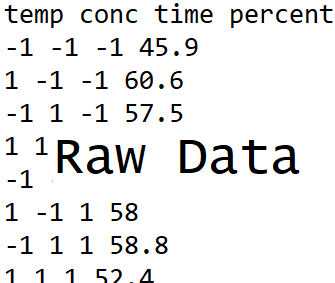
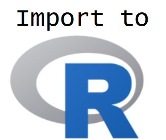
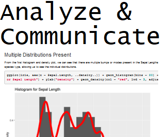

```{r setup, echo = FALSE, message = FALSE, warning = FALSE}
library(tidyverse)
library(haven)
options(dplyr.print_min = 5)
options(tibble.print_min = 5)
library(knitr)
library(htmlwidgets)
opts_chunk$set(message = FALSE, cache = TRUE, warning = FALSE)
```


## What is this course about?

Basic use of R for reading, manipulating, and plotting data!

<div style = "float: left;border:1px solid black;">
<a href = "https://www4.stat.ncsu.edu/~online/datasets/chemical.txt">
```{r step4a, fig.align = 'left', out.width = '205px', out.height = "249px", eval = TRUE, echo = FALSE}

```
</a>
</div>
<div style = "float: left;">
```{r arrow4a, fig.align = 'left', out.width = '30px', out.height = "249px", eval = TRUE, echo = FALSE}

```
</div>
<div style = "float: left;border:1px solid black;">
<a href = "https://www4.stat.ncsu.edu/~online/datasets/readChemData.r">
```{r step4b, fig.align = 'left', out.width = '205px', out.height = "249px", eval = TRUE, echo = FALSE}

```
</a>
</div>
<div style = "float: left;">
```{r arrow4b, fig.align = 'left', out.width = '30px', out.height = "249px", eval = TRUE, echo = FALSE}

```
</div>
<div style = "float: left;border:1px solid black;">
<a href = "https://www4.stat.ncsu.edu/~online/datasets/summChemData.r">
```{r step4c, fig.align = 'left', out.width = '205px', out.height = "249px", eval = TRUE, echo = FALSE}
knitr::include_graphics("../img/SummarizeR.png")
```
</a>
</div>
<div style = "float: left;">
```{r arrow4c, fig.align = 'left', out.width = '30px', out.height = "249px", eval = TRUE, echo = FALSE}

```
</div>
<div style = "float: left;border:1px dashed black;">
```{r step4d, fig.align = 'left', out.width = '205px', out.height = "249px", eval = TRUE, echo = FALSE}

```
</div>


## Recap So Far    

Dimension | Homogeneous   | Heterogeneous
--------- | ------------- | -------------
1d        | Atomic Vector | List
2d        | Matrix        | Data Frame

<br> 

Basic access via  

- Atomic vectors - `x[ ]`  
- Matrices - `x[ , ]`  
- Data Frames - `x[ , ]` or `x$name`  
- Lists - `x[ ]`, `x[[ ]]`, or `x$name`  


## Recap So Far  

- Reading Data

Type of file       | Package   | Function   
------------------ | --------- | -----------------
Delimited          | `readr`   | `read_csv()`, `read_tsv()`,`read_table()`, `read_delim(...,delim = ,...)`
Excel (.xls,.xlsx) | `readxl`  | `read_excel`
SPSS (.sav)        | `haven`   | `read_spss`
SAS (.sas7bdat)    | `haven`   | `read_sas`

<br>

- Resources for JSON, XML, databases, and APIs


## What is this course about?

Basic use of R for reading, manipulating, and plotting data!

- read and write basic R programs   
- import well formatted data into R
- **do basic data manipulation in R**   
- produce common numerical and graphical summaries in R  
- describe a use case of an analysis done in R  


## Where do we start?  

- Data manipulation idea  

- Documenting with Markdown  


## Where do we start?  

- Data manipulation idea  
  
- Documenting with Markdown  

- Logical statements 

- `dplyr`


## Where do we start?  

- Data manipulation idea  

- Documenting with Markdown

- Logical statements 

- `dplyr`

- Creating new variables  

     + Conditional execution (if then)  
     + For loops  
     + Vectorized functions   
 
- Reshaping Data


## Data manipulation idea  

We may want to subset our full data set or create new data   

- Grab only certain types of observations (**filter rows**)

```{r, echo = FALSE, fig.align='center', out.width = "500px"}
knitr::include_graphics("../img/filterVisualF.png")
```


## Data manipulation idea  

We may want to subset our full data set or create new data   

- Look at only certain variables (**select columns**)  
    
```{r, echo = FALSE, fig.align='center', out.width = "400px"}
knitr::include_graphics("../img/selectVisualF.png")
```


## Data manipulation idea  

We may want to subset our full data set or create new data   

- Create new variables

```{r, echo = FALSE, fig.align='center', out.width = "520px"}
knitr::include_graphics("../img/createVarVisualF.png")
```


## Data manipulation idea  

We may want to subset our full data set or create new data   

> - Vital to make your work reproducible!  

> - Traditional documentation through comments (`#` in R) in script

> - Communication and reproducibility vital!  

> - May have heard of [JUPYTER](http://jupyter.org/) notebooks  

> - R Markdown - built in notebook for R studio  

> - [Intro video](https://vimeo.com/178485416)


## Documenting with Markdown  


- R Markdown = Digital "Notebook":  Program that weaves word processing and code.  

- Designed to be used in three ways (R for Data Science)  


## Documenting with Markdown  


- R Markdown = Digital "Notebook":  Program that weaves word processing and code.  

- Designed to be used in three ways (R for Data Science)  
<ul>
  <li>Communicating to decision makers (focus on conclusions not code)</li>
  <li>Collaborating with other data scientists (including future you!)  </li>
  <li> As environment to do data science (documents what you did and what you were thinking)</li>
</ul>


## Documenting with Markdown  
**Verbage**

- May have heard of HTML (HyperText Mark-up Language)  
    + Write plain text that the browser interprets and renders  
    
    
## Documenting with Markdown  
**Verbage**

- May have heard of HTML (HyperText Mark-up Language)  
    + Write plain text that the browser interprets and renders  
    
- Markdown is a specific markup language  
    + Easier syntax  
    + Not as powerful  
    
- Any plain text file can be used (.Rmd extension associates it with R Studio)


## Documenting with Markdown  

R Markdown file contains three important types of content:

1. (Optional) YAML header surrounded by `---`s  

2. Chunks of R code   

3. Text mixed with simple text formatting instructions 


## Documenting with Markdown  
**Creating an R Markdown Document**

- R Studio makes it easy!  

```{r startMD.png, out.width = "700px",echo=FALSE, fig.align='center'}
knitr::include_graphics("../img/startMD.png")
```


## Documenting with Markdown  
**Creating an R Markdown Document**

- Commonly used document types can be created 

<div style="float: center;">
```{r startMDDoc.png, out.width = "500px",echo=FALSE, fig.align='center'}
knitr::include_graphics("../img/startMDDoc.png")
```
</div>


## Documenting with Markdown  
**Creating an R Markdown Document**

- Slide presentations 

```{r startMDPres.png, out.width = "500px",echo=FALSE, fig.align='center'}
knitr::include_graphics("../img/startMDPres.png")
```


## Documenting with Markdown  
**Creating an R Markdown Document**

- Truly Interactive Documents/Pages (require R backend)

```{r startMDShiny.png, out.width = "500px",echo=FALSE, fig.align='center'}
knitr::include_graphics("../img/startMDShiny.png")
```


## Documenting with Markdown  
**YAML Header**  

 - Define settings for document  

```
---
title: "Untitled"
author: "First Last"
date: "xxxx"
output: html_document
---
```  

- CTRL/CMD + Shift + k **knits** via this info 

     
## Documenting with Markdown  
**Code Chunks**  

 - Below YAML header: 'r chunk'  

```{r chunk_png, out.width = "500px",echo=FALSE, fig.align='center'}
knitr::include_graphics("../img/chunk.png")
```  

> - Start code chunk by typing ```{r} out or with CTRL/CMD + Alt/Option + I

> - Code will be executed when document is created    

> - Can specify options on individual code chunks  


## Documenting with Markdown  
**Markdown Syntax**
     
- Below code chunk is plain text with markdown sytnax  

```
## R Markdown

This is an R Markdown document. Markdown is a simple formatting syntax
for authoring HTML, PDF, and MS Word documents. For more details on
using R Markdown see <http://rmarkdown.rstudio.com>.

When you click the **Knit** button a document will be generated that
includes both content as well as the output of any embedded R code
chunks within the document. 
```

- When file created, "##" becomes a header, "<...>" a link, and ```**Knit**``` bold font


## Documenting with Markdown  

### R Markdown

This is an R Markdown document. Markdown is a simple formatting syntax
for authoring HTML, PDF, and MS Word documents. For more details on
using R Markdown see <http://rmarkdown.rstudio.com>.

When you click the **Knit** button a document will be generated that
includes both content as well as the output of any embedded R code
chunks within the document. 


## Where do we go from here?  

Briefly investigate:  

- Markdown syntax  

- Code chunks and their options  

- Changing type of output  


## Documenting with Markdown  

**Markdown syntax**  

- ```[Cheat Sheet link](https://www.rstudio.com/wp-content/uploads/2015/03/rmarkdown-reference.pdf)``` becomes [Cheat Sheet link](https://www.rstudio.com/wp-content/uploads/2015/03/rmarkdown-reference.pdf)  


## Documenting with Markdown  

**Markdown syntax**  

- ```[Cheat Sheet link](https://www.rstudio.com/wp-content/uploads/2015/03/rmarkdown-reference.pdf)``` becomes [Cheat Sheet link](https://www.rstudio.com/wp-content/uploads/2015/03/rmarkdown-reference.pdf)  

- ```# Header 1``` becomes a large font header  

- ```## Header 2``` becomes a slightly smaller font header  

- Goes to 6 headers  

    + Use of headers can automatically create a Table of Contents!


## Documenting with Markdown  

**Markdown syntax**  

- ```[Cheat Sheet link](https://www.rstudio.com/wp-content/uploads/2015/03/rmarkdown-reference.pdf)``` becomes [Cheat Sheet link](https://www.rstudio.com/wp-content/uploads/2015/03/rmarkdown-reference.pdf)  

- ```# Header 1``` becomes a large font header  

- ```## Header 2``` becomes a slightly smaller font header  

- Goes to 6 headers  

    + Use of headers can automatically create a Table of Contents!

- ```**bold**``` **and** ```__bold__```

- \`code\` becomes `code`  


## Documenting with Markdown  

**Markdown syntax**  

- Can do lists: be sure to end each line with two spaces!  

    + Indent sub lists four spaces  

<div style = "float: left; width: 50%">
```
* unordered list  
* item 2  
    + sub-item 1  
    + sub-item 2  

1. ordered list  
2. item 2  
    + sub-item 1  
    + sub-item 2  
```  
</div>
<div style = "float: right; width: 50%">
* unordered list  
* item 2  
    + sub-item 1  
    + sub-item 2  

1. ordered list  
2. item 2  
    + sub-item 1  
    + sub-item 2  
</div>


## Documenting with Markdown  

**Markdown syntax**  

- Can include basic tables (renders differently in slides than html doc)  

```
Table Header  | Second Header | Col 3
------------- | ------------- | -----------
Table Cell    | Cell (1, 2)   | Cell (1, 3)
Cell (2, 1)   | Cell (2, 2)   | Cell (2, 3) 
```
Table Header  | Second Header | Col 3
------------- | ------------- | -----------
Table Cell    | Cell (1, 2)   | Cell (1, 3)
Cell (2, 1)   | Cell (2, 2)   | Cell (2, 3) 


## Documenting with Markdown  

**Code chunks and their options**  


- Any R code can go into the chunk  

- Chunks evaluate sequentially (can use output from prior chunk)

> - Code can be added in line:  Ex: The Iris dataset has `r length(iris$Sepal.Length)` observations  

> - Added by beginning with back-tick `r` and ending with a back-tick: Iris has \`r `length(iris$Sepal.Length)`\`  


## Documenting with Markdown  

**Code chunks and their options**  

- Many options depending on chunk purpose!    

- Can hide/show code with `echo = FALSE/TRUE`  

- Can choose if code is evaluated with `eval = TRUE/FALSE`   

- `message = TRUE/FALSE` and `warning = TRUE/FALSE` can turn on/off displaying messages/warnings   


## Documenting with Markdown  

**Code chunks and their options**  

- Many options depending on chunk purpose!    

- Can hide/show code with `echo = FALSE/TRUE`  

- Can choose if code is evaluated with `eval = TRUE/FALSE`   

- `message = TRUE/FALSE` and `warning = TRUE/FALSE` can turn on/off displaying messages/warnings   

- Can set global options for all chunks  

```
opts_chunk$set(echo = FALSE, eval = TRUE, warning = FALSE)
```

- Allows for easy change of audience!  


## Documenting with Markdown  

**Changing type of output**  

R Markdown really flexible!  

```{r, echo = FALSE, fig.align='center'}
knitr::include_graphics("../img/compile.png")
```


## Documenting with Markdown  

**Changing type of output**  

Change output type in the YAML header:  

- Use CTRL/CMD + Shift + k or the Knit menu:

```{r knit, echo=FALSE, fig.align='center', out.width='150px'}
knitr::include_graphics("../img/knit.png")
```

> - Use code explicity:  
    `rmarkdown::render("file.Rmd", output_format = "word_document")`


## Documenting with Markdown  

**Changing type of output**  

For HTML & PDF can include Table of Contents with options    

```
output:
  html_document:
    toc: true
    toc_float: true
```


## Documenting with Markdown  

**Changing type of output**  

For HTML & PDF can include Table of Contents with options    

```
output:
  html_document:
    toc: true
    toc_float: true
```

For HTML another option is to make the code chunks hidden by default, but visible with a click:

```
output:
  html_document:
    code_folding: hide
```

## Documenting with Markdown  

**Changing type of output**  

HTML documents inherently interactive  

- Widgets can be included with appropriate **R package** 

```{r leafletP, echo = TRUE, eval = FALSE}
library(leaflet)
leaflet() %>%
  setView(174.764, -36.877, zoom = 16) %>% 
  addTiles() %>%
  addMarkers(174.764, -36.877, popup = "Maungawhau") 
```


## Documenting with Markdown  

**Changing type of output**  

```{r leafletE, echo = FALSE, eval = TRUE, fig.align='center'}
library(leaflet)
leaflet() %>%
  setView(174.764, -36.877, zoom = 16) %>% 
  addTiles() %>%
  addMarkers(174.764, -36.877, popup = "Maungawhau") 
```


## Documenting with Markdown  

**Changing type of output**  


- PDF  
    + Install MikTex and update its packages or install a smaller version using the `tinytex` package: `tinytex::install_tinytex()`  
```
output: pdf_document   
```
  

## Documenting with Markdown  

**Changing type of output**  

- PDF  
    + Install MikTex and update its packages or install a smaller version using the `tinytex` package: `tinytex::install_tinytex()`  
```
output: pdf_document   
```

- Word  
```
output: word_document
```

## Documenting with Markdown  

**Changing type of output**  

- PDF  
    + Install MikTex and update its packages or install a smaller version using the `tinytex` package: `tinytex::install_tinytex()`  
```
output: pdf_document   
```

- Word  
```
output: word_document
```

 - Slides (## for new slide)
```
output: ioslidespresentation
```


## Recap/Next Up! 

- Data manipulation idea  


- Documenting with Markdown

- Logical statements 

- `dplyr`

- Creating new variables  

     + Conditional execution (if then)  
     + For loops  
     + Vectorized functions   
 
- Reshaping Data 