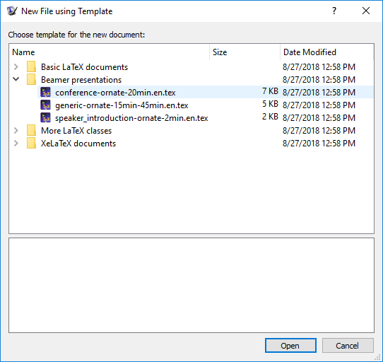

```{r setup, include=FALSE}
knitr::opts_chunk$set(echo = TRUE, eval = TRUE)
```

This document describes a process that should allow you to output to PDF from R Markdown if you haven't ever installed a TeX engine.  Steps:

1. Go to <https://miktex.org> and follow the instructions to install MiKTeX.  
```{r miktex, echo = FALSE, out.width = "200px", fig.align='center'}
knitr::include_graphics("../img/miktex.png")
```

In the end you'll go to the download page at <https://miktex.org/download> and download the appropriate installation for your operating system.  This file is quite large!   

2.  As you go through the installation wizard, be sure to choose "Install missing packages on-the-fly: Yes".  
```{r miktex2, echo = FALSE, out.width = "175px", fig.align='center'}
knitr::include_graphics("../img/miktexinstall.png")
```

3.  After installing, you'll have a TeX engine on your computer as well as a new app/program on your computer called TeXworks.  TeXworks is an editor for writing documents.  Open the TeXworks app.  Go to `File -> New From Template`.  
From here select Beamer Presenations and the first option of converence-ornate-20min.en.tex should do.  

```{r texworks2, echo = FALSE, out.width = "200px", fig.align='center'}

```

4.  With that document loaded, go to the top and hit the green play arrow (making sure pdfLaTeX is chosen, should be the default).
```{r texworks3, echo = FALSE, out.width = "200px", fig.align='center'}
knitr::include_graphics("../img/texworks3.png")
```
    You'll have to save the file somewhere you have write access to.  Now TeXworks will download a bunch of packages and things needed to compile to a PDF.  This may take a while as well.  In the end a PDF document should be created.  If you've gotten that, you should be ready to jump back to RStudio.

5.  Restart your computer.  Reopen RStudio.  It should automatically detect the installation.  Open the default template for an R Markdown to PDF and try to knit.  Hopefully things work!

If you try to knit and get an error about packages not related to R (i.e. the above didn't fix the common issue that comes up), you may need to use the TeX package manager and manually install whatever packages are missing...
