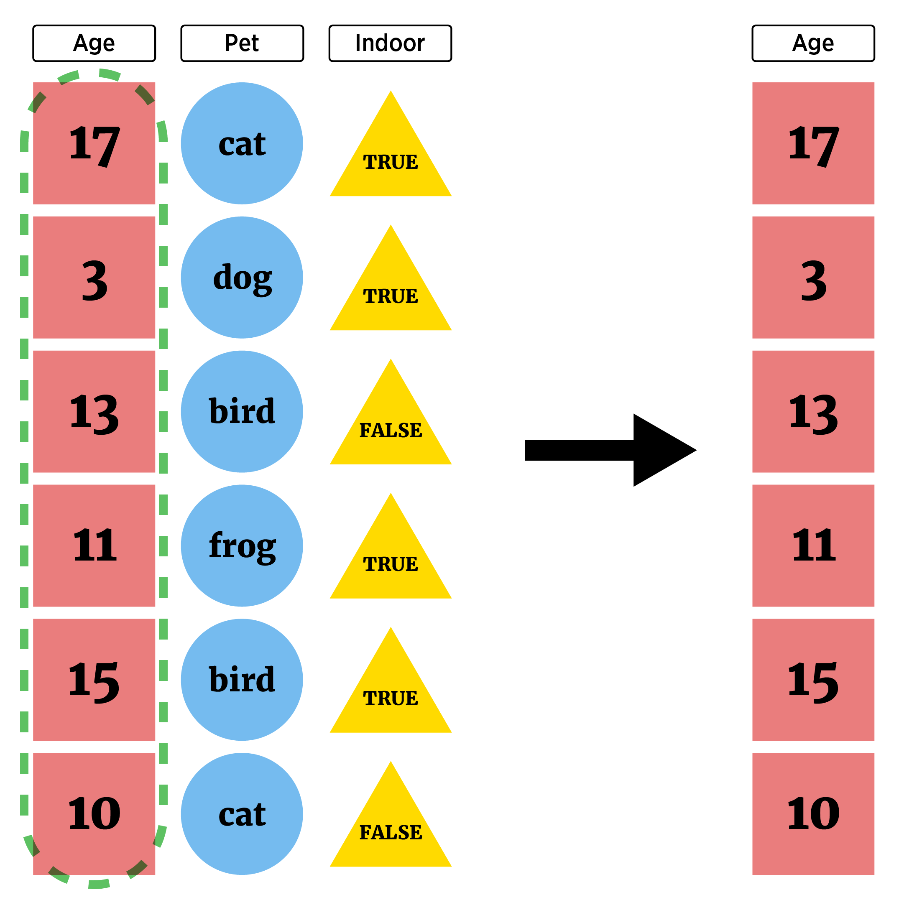

```{r setup, echo = FALSE, message = FALSE, warning = FALSE}
library(tidyverse)
library(haven)
options(dplyr.print_min = 5)
options(tibble.print_min = 5)
library(knitr)
opts_chunk$set(message = FALSE, cache = TRUE, warning = FALSE)
```


## Where are we at?  

- Data manipulation idea  

- Documenting with Markdown

- Logical statements 

- `dplyr`

- Creating new variables  

     + Conditional execution (if then)  
     + For loops  
     + Vectorized functions   
 
- Reshaping Data


## Data manipulation idea  

We may want to subset our full data set or create new data   

- Grab only certain types of observations (**filter rows**)

```{r, echo = FALSE, fig.align='center', out.width = "500px"}
knitr::include_graphics("../img/filterVisualF.png")
```


## Logical statements 

Goal: Subset rows or columns  

- **logical statement** - comparison that resolves as `TRUE` or `FALSE`  

<div style="float: left; width: 45%;">
```{r}
"hi" == " hi" #== is comparison
"hi" == "hi"
4 >= 1
```
</div>
<div style="float: right; width: 45%;">
```{r}
4 != 1
sqrt(3)^2  == 3
dplyr::near(sqrt(3)^2, 3)
```
</div>


## Logical statements 

Goal: Subset rows or columns  

- **logical statement** - comparison that resolves as `TRUE` or `FALSE`  

<div style="float: left; width: 45%;">
```{r}
#use of is. functions
is.numeric("Word")
is.numeric(10)
```
</div>
<div style="float: right; width: 45%;">
```{r}
is.character("10")
is.na(c(1:2, NA, 3))
is.matrix(c("hello", "world"))
```
</div>


## Logical statements 

Goal: Subset rows or columns  

- Consider the built-in `iris` dataframe

```{r}
head(iris)
```


## Logical statements 

Goal: Subset rows or columns  

- **logical statement** - useful for indexing an R object

- Concept:
    + Feed index a vector of `TRUE`/`FALSE`   
    + R returns elements where `TRUE` 


```{r,eval=FALSE}
iris[iris$Species == "setosa", ]
```


## Logical statements 

- Concept:
    + Feed index a vector of `TRUE`/`FALSE`   
    + R returns elements where `TRUE` 

```{r}
iris$Species == "setosa" #vector indicating setosa values
```


## Logical statements 

Goal: Subset rows or columns  

- **logical statement** - useful for indexing an R object

```{r}
iris[iris$Species == "setosa", ]
```


## Logical statements 

Goal: Subset rows or columns  

- **logical statement** - useful for indexing an R object

- Similarly, can use `subset` function  

```{r}
subset(iris, Species == "setosa")
```


## `dplyr`

Goal: Subset rows or columns  

- **logical statement** - useful for indexing an R object

- Similarly, can use `filter` from `dplyr` (installed with `tidyverse`)

```{r}
filter(iris, Species == "setosa")
```


## Logical statements 

Compound logicals via **Logical Operators**

- `&` 'and'
- `|` 'or'

Operator | A,B true       | A true, B false   | A,B false
---------|----------------|-------------------|--------------
`&`      | `A & B = TRUE` | `A & B = FALSE`   | `A & B = FALSE`
`|`      | `A | B = TRUE` | `A | B = TRUE`    | `A | B = FALSE`


## Logical statements 

Compound logicals via **Logical Operators**

- `&` 'and'
- `|` 'or'

Operator | A,B true       | A true, B false   | A,B false
---------|----------------|-------------------|--------------
`&`      | `A & B = TRUE` | `A & B = FALSE`   | `A & B = FALSE`
`|`      | `A | B = TRUE` | `A | B = TRUE`    | `A | B = FALSE`

- `&&` and `||` are alternatives  
  + Looks at only first comparison if given a vector of comparisons
  

## Logical statements 

Compound logicals via **Logical Operators**

```{r}
set.seed(3)
x <- runif(n = 10, min = 0, max = 1); x
(x < 0.25) | (x > 0.75)
(x < 0.25) || (x > 0.75)
```


## Logical statements 

Goal: Subset rows or columns  

- Only pull out large petal setosa flowers

```{r}
(iris$Petal.Length > 1.5) & (iris$Petal.Width > 0.3) & (iris$Species == "setosa")
```


## Logical statements 

Goal: Subset rows or columns  

- Only pull out large petal setosa flowers

```{r, eval = TRUE}
iris[(iris$Petal.Length > 1.5) & (iris$Petal.Width > 0.3) & (iris$Species == "setosa"), ]
```


## Logical statements 

Goal: Subset rows or columns  

- Only pull out large petal setosa flowers

- Easier with `subset` or `filter`!

```{r}
filter(iris, (Petal.Length > 1.5) & (Petal.Width > 0.3) & (Species == "setosa"))
```


## `tidyverse` for data manipulations

**Overview of dplyr and tidyr packages**

- `dplry` package made for most standard data manipulation tasks    

- `tidyr` package reshapes data  

- Both part of `tidyverse`  

- Make sure `library(tidyverse)` has been run!  
 

## Tidyverse Syntax

- Reason to prefer `dplyr` and packages from the `tidyverse` 

> - Fast!

> - Good defaults

> - All packages have similar syntax!  All work on `tibbles` (data frames)

> - Syntax:
`function(tibble, actions, ...)`


## `dplyr` 

- Basic commands 
    + `as_tibble()` - convert data frame to one with better printing  
    + `filter()` - subset **rows**  
    + `arrange()` - reorder **rows**  
    + `select()` - subset **columns**  
    + `rename()` - rename **columns**  
    + `mutate()` - add newly created **column**  
    + `transmute()` - create new variable  
    + `group_by()` - group **rows** by a variable   
    + `summarise()` - apply basic function to data  


## `dplyr` 

`as_tibble()` - convert data frame to one with better printing and no simplification

- Just 'wrap' data frame

```{r,eval=TRUE}
#install.packages("Lahman")
library(Lahman)
head(Batting, n = 4) #look at just first 4 observations
```


## `dplyr` 

```{r}
Batting <- as_tibble(Batting)
Batting
```

- If data read in with `haven`, `readxl`, or `readr` probably in this format!


## `dplyr`

`filter()` - subset **rows**

- Use `filter()` to obtain only PIT data
```{r}
filter(Batting, teamID == "PIT")
```


## `dplyr`

`filter()` - subset **rows**

- Multiple filters
```{r}
filter(Batting, teamID == "PIT" & yearID == 2000)
```


## `dplyr`

`arrange()` - reorder **rows**

```{r}
#reorder by teamID
arrange(Batting, teamID)
```


## `dplyr`

`arrange()` - reorder **rows**

```{r}
#get secondary arrangement as well
arrange(Batting, teamID, G)
```


## `dplyr`

`arrange()` - reorder **rows**

```{r}
#descending instead
arrange(Batting, teamID, desc(G))
```


## Data manipulation idea  

We may want to subset our full data set or create new data   

- Look at only certain variables (**select columns**)  
    
```{r, echo = FALSE, fig.align='center', out.width = "400px"}

```


## `dplyr`

`select()` - subset **columns**

- Often only want select variables (saw `$` and `[ , ]`)
- `select()` function has same syntax as other `dplyr` functions!

```{r}
#Choose a single column by name
select(Batting, X2B)
```


## `dplyr`

`select()` - subset **columns**

- Often only want select variables (saw `$` and `[ , ]`)
- `select()` function has same syntax as other `dplyr` functions!

```{r}
#Choose a single column by name
select(Batting, playerID, X2B)
```


## Aside: Piping or Chaining

- Applying multiple functions: nesting hard to parse!
- Piping or Chaining with `%>%` operator helps

```{r}
arrange(select(filter(Batting, teamID == "PIT"), playerID, G, X2B), desc(X2B))
```


## Aside: Piping or Chaining

- Applying multiple functions: nesting hard to parse!
- Piping or Chaining with `%>%` operator helps

```{r}
Batting %>% filter(teamID == "PIT") %>% select(playerID, G, X2B) %>% arrange(desc(X2B)) 
```


## Aside: Piping or Chaining

- Generically, pipe does the following

`x %>% f(y)` turns into `f(x,y)`  

`x %>% f(y) %>% g(z)` turns into `g(f(x, y), z)`  

- Can be used with functions outside the tidyverse if this structure works!    


## `dplyr`

`select()` - subset **columns**

- Many ways to select variables 

```{r}
#all columns between
Batting %>% select(X2B:HR)
```


## `dplyr`

`select()` - subset **columns**

- Many ways to select variables 

```{r}
#all columns containing
Batting %>% select(contains("X"))
```


## `dplyr`

`select()` - subset **columns**

- Many ways to select variables 

```{r}
#all columns starting with
Batting %>% select(starts_with("X"))
```


## `dplyr`

`select()` - subset **columns**

- Many ways to select variables 

```{r}
#multiple selections
Batting %>% select(starts_with("X"), ends_with("ID"), G)
```


## `dplyr`

`select()` - subset **columns**

- May want to reorder variables

```{r}
#reorder
Batting %>% select(playerID, HR, everything())
```


## `dplyr`

`rename()` - rename variables

```{r}
#rename our previous
Batting %>% 
  select(starts_with("X"), ends_with("ID"), G) %>% 
  rename("Doubles" = X2B, "Triples" = X3B)
```


## `dplyr`

[Cheat sheet](https://www.rstudio.com/wp-content/uploads/2015/02/data-wrangling-cheatsheet.pdf)

- Basic commands 
    + `as_tibble()` - convert data frame to one with better printing
    + `filter()` - subset **rows**
    + `arrange()` - reorder **rows**
    + `select()` - subset **columns**

- Many `joins` to combine tibbles too! (Similar to SQL)


## Recap/Next Up!

- Data manipulation idea  

- Documenting with Markdown

- Logical statements 

- `dplyr`

- Creating new variables  

     + Conditional execution (if then)  
     + For loops  
     + Vectorized functions   
     
- Reshaping Data

