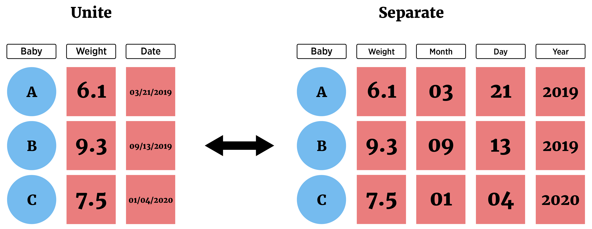

```{r setup, echo = FALSE, message = FALSE, warning = FALSE}
library(tidyverse)
library(haven)
options(dplyr.print_min = 5)
options(tibble.print_min = 5)
library(knitr)
opts_chunk$set(message = FALSE, cache = TRUE, warning = FALSE)
```


## Recap/Next Up!

- Data manipulation idea  

- Documenting with Markdown

- Logical statements 

- `dplyr`

- Creating new variables  

     + Conditional execution (if then)  
     + For loops  
     + Vectorized functions   
     
- Reshaping data

 


## Reshaping Data  

Long vs Wide format data


```{r, out.width="450px", echo = FALSE, fig.align='center'}
knitr::include_graphics("../img/longWideF.png")
```


## Reshaping Data  
**`tidyr` package**

Easily allows for two very important actions

> - `pivot_longer()` - lengthens data by increasing the number of rows and decreasing the number of columns    
    <ul>  
        <li> Most important as analysis methods often prefer this form</li>  
    </ul>  
         
> - `pivot_wider()` - widens data by increasing the number of columns and decreasing the number of rows  


## Reshaping Data  
**`tidyr` package**

- Data in 'Wide' form


```{r, eval = FALSE}
tempsData <- read_table2(file = "https://www4.stat.ncsu.edu/~online/datasets/cityTemps.txt") 
tempsData
```
```{r, echo = FALSE}
tempsData <- read_table2(file = "../datasets/cityTemps.txt")
tempsData
```


## Manipulating Data

```{r, echo = FALSE}
tempsData
```

- Switch to 'Long' form with `pivot_longer()`  
    + `cols` = columns to pivot to longer format (`cols = 2:8`)  
    + `names_to` = new name(s) for columns created (`names_to = "day"`)  
    + `values_to` = new name(s) for data values (`values_to = "temp"`)  


## Manipulating Data

- Switch to 'Long' form with `pivot_longer()`  
    + `cols` = columns to pivot to longer format (`cols = 2:8`)  
    + `names_to` = new name(s) for columns created (`names_to = "day"`)  
    + `values_to` = new name(s) for data values (`values_to = "temp"`)  

```{r}
tempsData %>% pivot_longer(cols = 2:8, names_to = "day", values_to = "temp")
```


## Reshaping Data  

- Switch to 'Long' form with `pivot_longer()`  
- Can provide columns in many ways!
```{r}
newTempsData <- tempsData %>% 
  pivot_longer(cols = sun:sat, names_to = "day", values_to = "temp")
newTempsData
```

## Reshaping Data  

- Switch to 'Wide' form with `pivot_wider()`  
    + `names_from` = column(s) to get the names used in the output columns (`names_from = "day"`)
    + `values_from` = column(s) to get the cell values from (`values_from = "temp"`) 

```{r}
newTempsData %>% pivot_wider(names_from = "day", values_from = "temp")
```


## Reshaping Data  

- Separate a column (or combine two columns) using `separate()` and `unite()`

```{r, out.width="650px", echo = FALSE, fig.align='center'}

```


## Reshaping Data  

- Separate a column (or combine two columns) using `separate()` and `unite()`

- Consider data set on air pollution in Chicago  


```{r, eval = FALSE}
chicagoData <- read_csv("https://www4.stat.ncsu.edu/~online/datasets/Chicago.csv")
chicagoData
```
```{r, echo = FALSE}
chicagoData <- read_csv("../datasets/Chicago.csv")
chicagoData
```


## Manipulating Data

- Can parse with `separate`:

```{r}
chicagoData %>% separate(date, c("Month", "Day", "Year"), sep = "/", 
												 convert = TRUE, remove = FALSE)
```


## Manipulating Data

- Can combine with `unite`:

```{r}
chicagoData %>% separate(date, c("Month", "Day", "Year"), sep = "/", 
												 convert = TRUE, remove = FALSE) %>%
  unite(MonthDay, Month, Day, sep = "-")
```


## Recap!

- Data manipulation idea  

- Documenting with Markdown

- Logical statements 

- `dplyr`

- Creating new variables  

     + Conditional execution (if then)  
     + For loops  
     + Vectorized functions   
     
- Reshaping data

