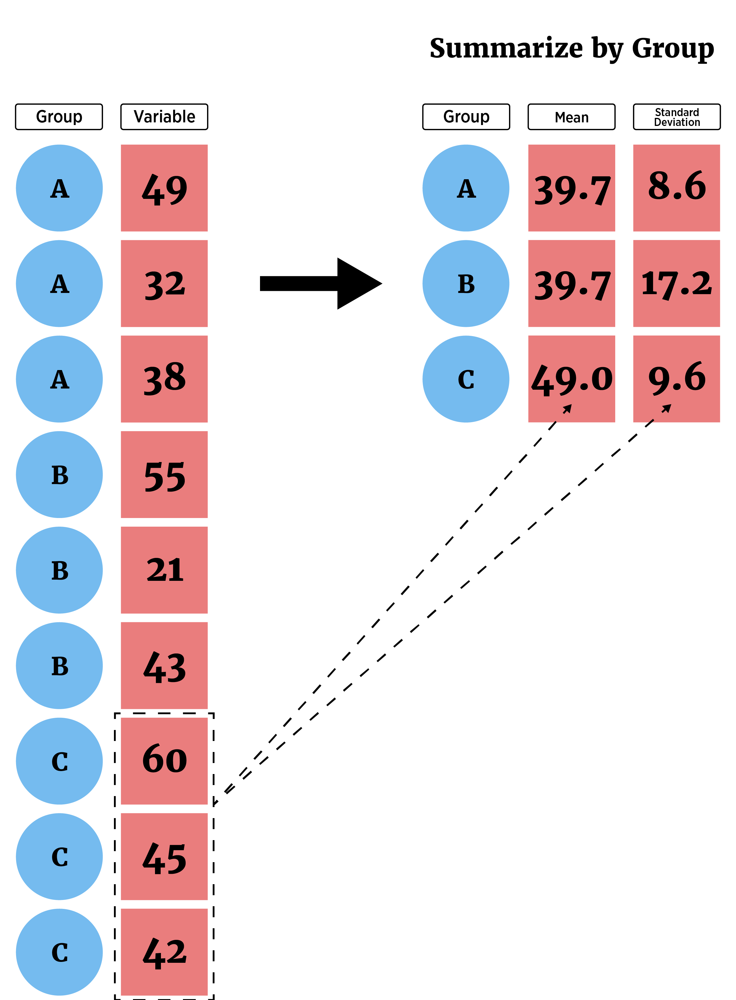

```{r, echo = FALSE, message = FALSE, warning = FALSE}
library(tidyverse)
library(haven)
library(knitr)
options(dplyr.print_min = 5)
options(tibble.print_min = 5)
opts_chunk$set(message = FALSE, cache = TRUE)
```


## What is this course about?

Basic use of R for reading, manipulating, and plotting data!

<div style = "float: left;border:1px solid black;">
<a href = "https://www4.stat.ncsu.edu/~online/datasets/chemical.txt">
```{r step4a, fig.align = 'left', out.width = '205px', out.height = "249px", eval = TRUE, echo = FALSE}
knitr::include_graphics("../img/rawData.png")
```
</a>
</div>
<div style = "float: left;">
```{r arrow4a, fig.align = 'left', out.width = '30px', out.height = "249px", eval = TRUE, echo = FALSE}
knitr::include_graphics("../img/arrow.png")
```
</div>
<div style = "float: left;border:1px solid black;">
<a href = "https://www4.stat.ncsu.edu/~online/datasets/readChemData.r">
```{r step4b, fig.align = 'left', out.width = '205px', out.height = "249px", eval = TRUE, echo = FALSE}
knitr::include_graphics("../img/ImportR.png")
```
</a>
</div>
<div style = "float: left;">
```{r arrow4b, fig.align = 'left', out.width = '30px', out.height = "249px", eval = TRUE, echo = FALSE}
knitr::include_graphics("../img/arrow.png")
```
</div>
<div style = "float: left;border:1px solid black;">
<a href = "https://www4.stat.ncsu.edu/~online/datasets/summChemData.r">
```{r step4c, fig.align = 'left', out.width = '205px', out.height = "249px", eval = TRUE, echo = FALSE}
knitr::include_graphics("../img/SummarizeR.png")
```
</a>
</div>
<div style = "float: left;">
```{r arrow4c, fig.align = 'left', out.width = '30px', out.height = "249px", eval = TRUE, echo = FALSE}
knitr::include_graphics("../img/arrow.png")
```
</div>
<div style = "float: left;border:1px dashed black;">
```{r step4d, fig.align = 'left', out.width = '205px', out.height = "249px", eval = TRUE, echo = FALSE}
knitr::include_graphics("../img/AnalysisR.png")
```
</div>


## What is this course about?

Basic use of R for reading, manipulating, and plotting data!

- read and write basic R programs   
- import well formatted data into R
- do basic data manipulation in R   
- **produce common numerical and graphical summaries in R**  
- describe a use case of an analysis done in R  


## Where do we start?  

- Understand types of data and their distributions  


## Where do we start?  

- Understand types of data and their distributions  

- Numerical summaries (across subgroups)  

```{r, echo = FALSE,  out.width = "260px", fig.align='center'}
knitr::include_graphics("../img/summarizeAllF.png")
```


## Where do we start?  

- Understand types of data and their distributions  

- Numerical summaries (across subgroups)  

```{r, echo = FALSE,  out.width = "295px", fig.align='center'}

```


## Where do we start?  

- Understand types of data and their distributions  

- Numerical summaries (across subgroups)  

    + Contingency Tables  
    + Mean/Median  
    + Standard Deviation/Variance/IQR
    + Quantiles/Percentiles
    

## Where do we start?  

- Understand types of data and their distributions  

- Numerical summaries (across subgroups)  

    + Contingency Tables  
    + Mean/Median  
    + Standard Deviation/Variance/IQR
    + Quantiles/Percentiles

- Graphical summaries (across subgroups)  

    + Bar plots  
    + Histograms  
    + Box plots  
    + Scatter plots

    

## Understanding Data

- How to summarize data?  

- Depends on data type:  

    + Categorical (Qualitative) variable - entries are a label or attribute   
    + Numeric (Quantitative) variable - entries are a numerical value where math can be performed


```{r, echo = FALSE, out.width="500px", fig.align='center'}
knitr::include_graphics("../img/variableTypes.png")
```


## Understanding Data

Common goal: Describe the **distribution** of the variable  

- Distribution = pattern and frequency with which you observe a variable  

> - Categorical variable - describe relative frequency (or count) in each category

> - Numeric variable - describe the shape, center, and spread


## Contingency tables 

Categorical variable - entries are a label or attribute   

- Tables (contingency tables) via `table`

    + Show frequency/proportion of categories
    
    
## Contingency tables 

Categorical variable - entries are a label or attribute   

- Tables (contingency tables) via `table`

    + Show frequency/proportion of categories

- Consider data on titanic passengers in `titanic.csv`

```{r,echo=FALSE}
titanicData <- read_csv("../datasets/titanic.csv")
titanicData
```


## Contingency tables 

- Create **one-way contingency tables** for each of three categorical variables: 

    + embarked (where journey started)  
    + survived (survive or not)    
    + sex (Male or Female)  

<div style="float: left; width: 45%;">

```{r}
table(titanicData$embarked)
```
</div>
<div style="float: right; width: 45%;">
```{r}
table(titanicData$survived)
table(titanicData$sex)
```
</div>


## Two-way contingency tables 

- Create **two-way contingency tables** for pairs of categorical variables  

<div style="float: left; width: 45%;">
```{r}
table(titanicData$survived,
      titanicData$sex)
```
</div>
<div style="float: right; width: 45%;">
```{r}
table(titanicData$survived,
      titanicData$embarked)
table(titanicData$sex,
      titanicData$embarked)
```
</div>


## Three-way contingency tables 

- Create a **three-way contingency table** for three categorical variables 

```{r}
table(titanicData$sex, titanicData$embarked, titanicData$survived)
```


## Three-way contingency tables 

- Create a **three-way contingency table** for three categorical variables (order matters for output!)

- Example of an array!  3 dimensions `[ , , ]`

```{r}
tab <- table(titanicData$sex, titanicData$embarked, titanicData$survived)

str(tab)
```


## Conditional contingency tables

- Can obtain **conditional** bivariate info!

```{r,echo=FALSE}
str(tab)
```
```{r}
#returns embarked vs survived table for females
tab[1, , ]
```


## Conditional contingency tables

- Can obtain **conditional** bivariate info!

```{r,echo=FALSE}
str(tab)
```
```{r}
#returns embarked vs survived table for males
tab[2, , ]
```


## Conditional contingency tables

- Can obtain **conditional** bivariate info!

```{r,echo=FALSE}
str(tab)
```
```{r}
#returns survived vs sex table for embarked "C"
tab[, 1, ]
```


## Conditional contingency tables

- Can obtain **conditional** univariate info too!


```{r,echo=FALSE}
str(tab)
```
```{r}
#Survived status for males that embarked at "Q"
tab[2, 2, ]
```


## Numerical summaries: Numeric variables  

Numeric variable - entries are a numerical value where math can be performed

**Single variable:**  

- Shape: Histogram or Density plot

> - Measures of center: Mean, Median

> - Measures of spread: Variance, Standard Deviation, Quartiles, IQR


## Numerical summaries: Numeric variables  

Numeric variable - entries are a numerical value where math can be performed

**Single variable:**  

- Shape: Histogram or Density plot

- Measures of center: Mean, Median

- Measures of spread: Variance, Standard Deviation, Quartiles, IQR

**Two Variables:**

- Shape: Scatter plot

- Measures of linear relationship: Covariance, Correlation   


## Numerical summaries: Numeric variables  

- Look at carbon dioxide (CO2) uptake data set  

    + Response recorded: `uptake` CO2 uptake rates in grass plants  
    + Environment manipulated: `Treatment` - chilled/nonchilled  
    + Ambient CO2 specified and measured: `conc`  
    
```{r}
CO2 <- tbl_df(CO2)
CO2
```


## Measures of center

Mean & Median

```{r}
mean(CO2$uptake)
#note you can easily get a trimmed mean
mean(CO2$uptake, trim = 0.05) #5% trimmed mean
median(CO2$uptake)
```


## Measures of spread

Variance, Standard Deviation, Quartiles, & IQR

```{r}
#quartiles and mean
summary(CO2$uptake)
```

<div style="float: left; width: 40%;">
```{r}
var(CO2$uptake)
sd(CO2$uptake)
```
</div>
<div style="float: right; width: 55%;">
```{r}
IQR(CO2$uptake)
quantile(CO2$uptake, probs = c(0.1, 0.2))
```
</div>


## Measures of linear relationship

Covariance & Correlation   

```{r}
cov(CO2$conc, CO2$uptake)
cor(CO2$conc, CO2$uptake)
```


## Numerical summaries: Numeric variables  

Usually want summaries for different **subgroups of data** 

- Ex: Get similar uptake summaries for each **Treatment**


## Numerical summaries: Numeric variables  

Usually want summaries for different **subgroups of data** 

- Ex: Get similar uptake summaries for each **Treatment**

- `dplyr` easy to use but can only return one value


## Numerical summaries: Numeric variables  

Usually want summaries for different **subgroups of data** 

- Ex: Get similar uptake summaries for each **Treatment**

- `dplyr` easy to use but can only return one value

Idea: 

- Use `group_by` to create subgroups associated with the data frame

- Use `summarize` to create basic summaries for each subgroup

    
    
## Summarizing across groups  

- Ex: Get similar uptake summaries for each **Treatment**


```{r}
CO2 %>% group_by(Treatment) %>% 
	summarise(avg = mean(uptake), med = median(uptake), var = var(uptake))
```


## Summarizing across groups  

- Ex: Get similar uptake summaries for each **Treatment** and **Concentration**

```{r}
CO2 %>% group_by(Treatment, conc) %>% 
		summarise(avg = mean(uptake), med = median(uptake), var = var(uptake))
```


## Summarizing across groups

`dplyr` has variations on `summarise` that can be used:

- `summarise_all()` - Apply functions to every column  

- `summarise_at()` - Apply functions to specific columns  

- `summarise_if()` - Apply functions to all columns of one type


## Summarizing across groups  

- Ex: Get similar uptake summaries for each **Treatment**

- Built-in `aggregate()` function more general  


## Summarizing across groups  

- Ex: Get similar uptake summaries for each **Treatment**

- Built-in `aggregate()` function more general  

- Basic use gives response (`x`) and a `list` of variables to group `by`

```{r}
aggregate(x = CO2$uptake, by = list(CO2$Treatment), FUN = summary)
```


## Summarizing across groups  

- Ex: Get similar uptake summaries for each **Treatment**

- Built-in `aggregate()` function more general  

- Commonly used with `formula` notation!

```{r}
aggregate(uptake ~ Treatment, data = CO2, FUN = summary)
```


## Summarizing across groups  

- Ex: Get similar uptake summaries for each **Treatment**

- Built-in `aggregate()` function more general  

- Commonly used with `formula` notation!

```{r, eval = FALSE}
aggregate(uptake ~ Treatment, data = CO2, FUN = summary)
```

`uptake ~ Treatment` - formula notation in R  

- Idea: uptake (LHS) modeled by Treatment levels (RHS)


## Summarizing across groups  

- Ex: Get similar uptake summaries for each **Treatment** and **Concentration**

- Built-in `aggregate()` function more general

- Commonly used with `formula` notation!

```{r, eval = FALSE}
aggregate(uptake ~ Treatment + conc, data = CO2, FUN = summary)
```

`uptake ~ Treatment + conc` model uptake by levels of Treatment and conc


## Summarizing across groups  

- Ex: Get similar uptake summaries for each **Treatment** and **Concentration**

```{r}
aggregate(uptake ~ Treatment + conc, data = CO2, FUN = summary)
```


## Recap/Next Up!

- Understand types of data and their distributions  

- Numerical summaries

    + Contingency Tables: `table`  
    + Mean/Median: `mean`, `median`
    + Standard Deviation/Variance/IQR: `sd`, `var`, `IQR` 
    + Quantiles/Percentiles: `quantile`

- Across subgroups with `dplyr::group_by` and `dplyr::summarize` or `aggregate`

> - Graphical summaries (across subgroups)  
 
