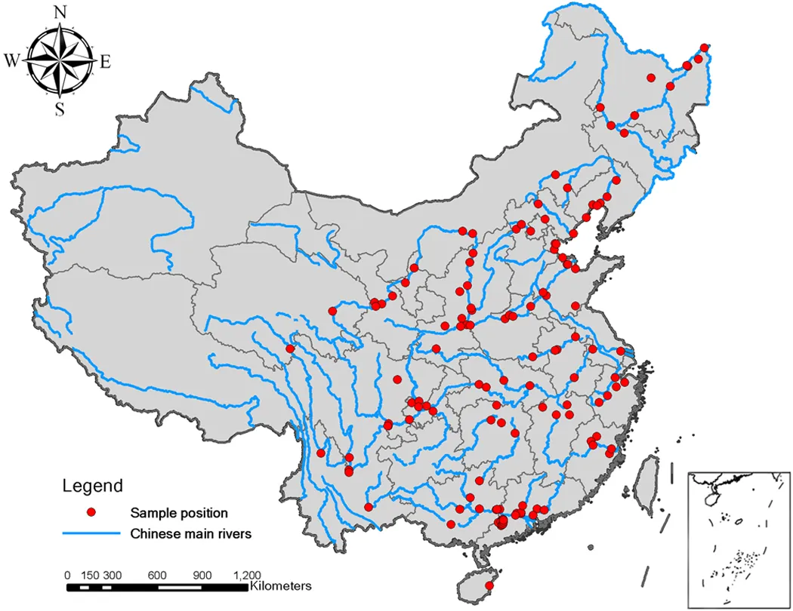

```{r setup, echo=FALSE, warning = FALSE, message = FALSE}
#install packages if needed
#load packages
library(readxl)
library(rpart)
library(rpart.plot)
library(tidyverse)
library(corrplot)
library(knitr)
library(rgl)
library(DT)
```

# Introduction  

The purpose of this page is to show how R can be used to replicate part of the analysis done in the *Nature* article [Control factors and scale analysis of annual river water, sediments and carbon transport in China](http://www.nature.com/articles/srep25963).  

# About the Data 

Main purpose of the *Nature* article (from the abstract):

> Under the context of dramatic human disturbances on river system, the processes that control the transport of water, sediment, and carbon from river basins to coastal seas are not completely understood. Here we performed a quantitative synthesis for 121 sites across China to find control factors of annual river exports (Rc: runoff coefficient; TSSC: total suspended sediment concentration; TSSL: total suspended sediment loads; TOCL: total organic carbon loads) at different spatial scales.

```{r, echo = FALSE, fig.align='center', out.width="75%"}

```

The data for this study is available to download [here](http://www.nature.com/articles/srep25963).  A full description of variables available [here](http://www.nature.com/articles/srep25963/tables/1).  

The data have been downloaded locally and renamed `RiverData.xls`.  We'll start by reading the data in using the `readxl` package!  The data is displayed using the `DT` package function `datatable`.

```{r, message = FALSE, warning = FALSE}
#read in data
River <- read_excel("RiverData.xls", sheet = 2, col_types = c(rep("guess", 13), "numeric", rep("guess", 24)))
datatable(River %>% select(Name, `Size(km2)`, Rc, `TSSC(mg/L)`, `TSSL(g m-2 a-1)`, MAP, MAT, DOCL), rownames = FALSE)
```

# Analysis 

## Classification of the size, environmental variables and general statistics

In R it is really easy to create publication ready summaries and graphics.  We'll start by recreating part of table 2 from the article.  We first need to create a new variable corresponding to the `Size` as specified in the article.  We'll create this variable as a `factor` so we can reorder the levels to print in the order we'd like.

```{r}
River <- River %>% mutate(Size = factor(ifelse(`Size(km2)` < 15000, "Small", 
                                               ifelse(`Size(km2)` < 100000, "Medium",
                                                      ifelse(`Size(km2)` < 350000, "Sizeable",
                                                             ifelse(`Size(km2)` < 700000, "Large", "Great"))))))

River$Size <- ordered(River$Size,
                      levels = c("Small", "Medium", "Sizeable", "Large", "Great"))
```

Next we'll use `dplyr` to create the basic summaries (removing missing values where needed).  These don't quite line up with what is reported so it seems the authors did something not described with their data or the data have been updated since the original descriptions were made.  Also, standard errors should really be reported so these are given as well.

```{r}
River %>% group_by(Size) %>% filter(!is.na(Rc)) %>% summarise(MeanRc = mean(Rc), 
                                                              countRc = n(), 
                                                              SERc = sd(Rc)/n())
River %>% group_by(Size) %>% filter(!is.na(`TSSC(mg/L)`)) %>% summarise(MeanTSSC = mean(`TSSC(mg/L)`), 
                                                                        countTSSC = n(),
                                                                        SETSSC = sd(`TSSC(mg/L)`/n()))
```


## Correlation Matrix of Variables

Next we'll find the correlation matrix (using Spearman's rank correlation)for the numeric variables in the data.  Using the `corrplot` function from the similarly named packages, we can recreate figure 2 from the paper.

```{r, out.width = "1200px", fig.align = "center"}
Correlation <- River %>% select(`RD(mm)`, MAP, Rc, MAT, DOCL, `TOCL (g m-2 a-1)`, `SOC(%)`, QA, `Vc(%)`, S, POCL, 
                 `TSSL(g m-2 a-1)`, `Size(km2)`, LONG, `TSSC(mg/L)`, DOCC, POCC, `RSCI(%)`, LAT) %>%
  cor(use = "pairwise.complete.obs", method = "spearman")
#Make diagonal 0 for ease of display
Correlation <- Correlation - diag(nrow = nrow(Correlation))

#use corrplot package function
corrplot(Correlation, type = "full", title = "Figure 2: Correlation matrix of variables.", tl.pos="lt", diag = TRUE, tl.cex = 0.6, mar = c(3, 1, 5, 1), tl.offset = 1, tl.srt = 45, cl.pos = "r")
corrplot(Correlation, type = "lower", method = "number", add = TRUE, diag = FALSE, tl.pos = "n", number.cex = 0.38, cl.pos = "n")
```


## CART Based Regression Tree of Environmental Variables

There are many packages to create trees in R, we'll use the `rpart` package as the authors did in this paper.  


> The purpose of the third step was to identify the primary control factors for carbon transport within the database. We used a classification and regression tree (CART) model as an exploratory technique to identify natural and anthropogenic factors that significantly affected the carbon transport. ... As a tree-based hierarchical model, CART is an ideal analytical tool for exploring multivariate responses in complex data because CART can capture the interaction effects among the control factors and identify the most effective variables. We selected Rc, TSSC, TSSL, and TOCL as the response variables, and all of the relevant environmental variables were included in the model.


As with many single tree based models, large trees must be fit and then pruned.  The authors use `cp` as their criterion for choosing their model.  They outlined their method as follows:

> Initially, we set the CP value to 0.001 in the model procedure and obtained the initial trees. But these trees were too complex which needed to be pruned. Thus we used “printcp”, “plotcp”, and “prune” function of the “rpart” package to examine and regenerate the results. Finally the optimal trees were obtained with CP values of 0.012, 0.0082, 0.0079, and 0.013 for the Rc, TSSC, TSSL, and TOCL, respectively.

Let's recreate this model for `Rc`!  To get a model similar to theirs we'll just use variables that showed in their final model.  Our `cp` value differs from theirs.  Our final plot is similar to their figure 3.  

```{r, fig.width=14,fig.height=10}
rpart_tree <- rpart(Rc ~ MAP + MAT, data = River, method = "anova", cp = 0.001)
#look at stats
printcp(rpart_tree)
plotcp(rpart_tree)
pruned_tree <- prune(rpart_tree, cp = 0.02)
pruned_tree
plot(pruned_tree)
text(pruned_tree, pretty = TRUE)
```

Looking at the plot made and used in their paper, it leaves a bit to be desired.  The companion package rpart.plot can improve the plot.  

```{r,fig.width=10,fig.height=5}
rpart.plot(pruned_tree)
```

It is very easy to predict for new values with most models fit in R.  The generic `predict` funciton does the work for us.  The following predicts the `Rc` value using the tree for `MAP` at its minimum value and `MAT` at its mean as well as `MAP` and `MAT` both at their means.  

```{r}
predict(pruned_tree, newdata = data.frame(MAP = c(min(River$MAP), mean(River$MAP)), MAT = rep(mean(River$MAT), 2)))
```


## Runoff Coefficient Variations 

Lastly, we'll recreate an interesting plot the authors created showing boxplots with lines connecting means for different groups.  More specifically, figure 4 gives boxplots for the `Rc` variable for each level of the `Size` variable.  The `MAP` variable was grouped into a few levels and the mean `Rc` values for each `MAP` group are connected by lines.  This plot isn't super clear but shows the flexibility of ggplot!


First, we'll create the grouped MAP variabl we'll call `MATClass`.  

```{r}
River <- mutate(River, MATClass = ifelse(MAP < 600, "Semiarid",
                                         ifelse(MAP >= 600 & MAP < 850, "Moist",
                                                ifelse(MAP >= 850 & MAP < 1500, "Humid", "Wet"))))
#Reorder levels
River$MATClass<-ordered(River$MATClass, levels = c("Semiarid", "Moist", "Humid", "Wet"))
```

Now we'll create the plot using `ggplot`.

```{r, message = FALSE, warning = FALSE}
g <- ggplot(data = River, aes(x = Size, y = Rc))

g + geom_boxplot(lwd = 1) + 
  coord_cartesian(ylim = c(0, 1)) + 
  labs(title = "MAP", x = "Size") +
  geom_point(aes(col = MATClass), size = 4) +
  stat_summary(fun.y = mean, geom = "line", lwd = 2, aes(group = MATClass, col = MATClass)) +
  theme_classic()
```

# Wrap Up  

Hopefully this page shows you how R can be used to create publication ready statistics and graphics as well as a quick website!  

Full article citation:

Song, C., Wang, G., Sun, X. et al. Control factors and scale analysis of annual river water, sediments and carbon transport in China. Sci Rep 6, 25963 (2016). https://doi.org/10.1038/srep25963