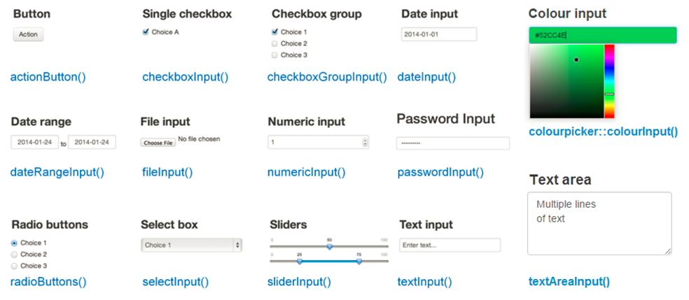
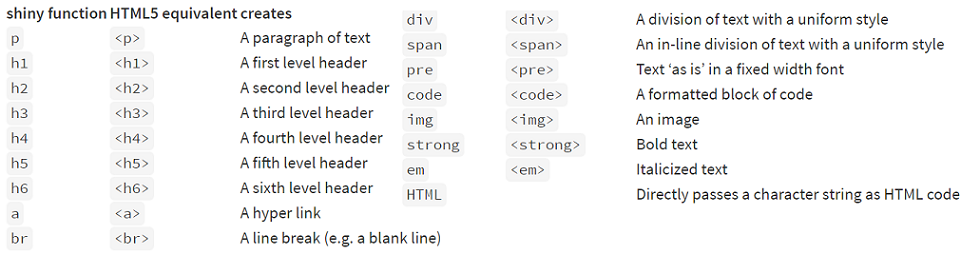
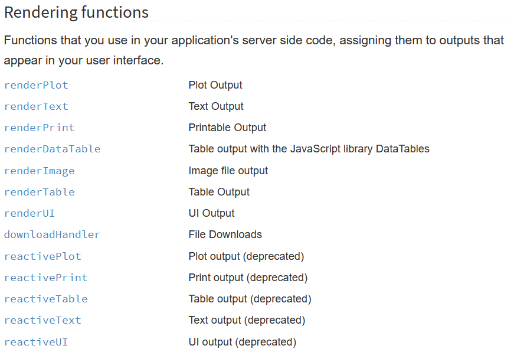

```{r setup, echo = FALSE, message = FALSE, warning = FALSE}
library(shiny)
library(tidyverse)
options(dplyr.print_min = 5)
library(knitr)
library(plotly)
library(DT)
opts_chunk$set(echo = FALSE)
```


## What is R Shiny?  

- [R Shiny Package](http://shiny.rstudio.com/)  

    + Developed by RStudio  
    + Allows for creation of apps and dashboards  
  
- Usually a .R file (or two) with special code to create an app  
  
    + `ui.R` (User Interface)  
    + `server.R` (R functions that run/respond to UI)
    + `app.R` (both UI and server combined)  
    
- We'll just add them to HTML documents  

- Requires no HTML, CSS, or JavaScript!

  
## Example App
```{r eruptions}
inputPanel(
  selectInput("n_breaks", label = "Number of bins:",
              choices = c(10, 20, 35, 50), selected = 20),
  
  sliderInput("bw_adjust", label = "Bandwidth adjustment:",
              min = 0.2, max = 2, value = 1, step = 0.2)
)

renderPlot({
  hist(faithful$eruptions, probability = TRUE, breaks = as.numeric(input$n_breaks),
       xlab = "Duration (minutes)", main = "Geyser eruption duration")
  
  dens <- density(faithful$eruptions, adjust = input$bw_adjust)
  lines(dens, col = "blue")
})
```


## Available Apps  

- Many available resources.  Many have their source code available on github!  

- [Book of Apps for Statistics Teaching (BOAST)](https://sites.psu.edu/shinyapps/)  
- [Stat Concepts](https://github.com/gastonstat/shiny-introstats/)  

- [More Stat Concepts](https://www.researchgate.net/publication/298786680_Web_Application_Teaching_Tools_for_Statistics_Using_R_and_Shiny)  

- [Even more!](http://www.statistics.calpoly.edu/shiny)

- [Shiny Gallery/Showcase](https://shiny.rstudio.com/gallery/)


## Our plan

- Learn about user interface (UI) elements  

    + Input widgets (sliders, numeric inputs, etc.)
    + Formatting of text
    + UI layout

- Understand how the server (R) backend works with the UI elements  

    + Accessing UI inputs
    + Creating outputs


## Create a shiny markdown doc

- File --> New file --> R Markdown  

- Really, we just need to add `runtime: shiny` to the YAML header for an HTML doc!  

```{r, echo = FALSE, fig.align='center', out.width="40%"}
knitr::include_graphics("shinyDoc.png")
```

## Adding Widgets  

  - Widgets can be added using their `*Input` functions  
  - You can just place widgets within an R code chunk!  

```{r, out.width = "85%", fig.align='center'}

```
  

## Widget Example  

```{r, eval = FALSE, echo = TRUE}
numericInput("num", "Enter a Number", value = 0, min = 0, max = 100)
sliderInput("slide", label = "A Slider!", min = 0, max = 1, value = 0.5, step = 0.05)
```

```{r, echo = FALSE}
numericInput("num", "Enter a Number", value = 0, min = 0, max = 100)
sliderInput("slide", label = "A Slider!", min = 0, max = 1, value = 0.5, step = 0.05)
```


## Adding Formatted Text  

Can also add:  

- Any plain strings  
- Formatted text (using HTML type functions)  
```{r, out.width = "85%", fig.align='center'}

```

## Widget & Text Example  

```{r, eval = FALSE, echo = TRUE}
h2("First App title!")
a("RStudio link", href = "https://www.RStudio.com")
numericInput("num", "Enter a Number", value = 0, min = 0, max = 100)
sliderInput("slide", label = "A Slider!", min = 0, max = 1, value = 0.5, step = 0.05)
```

```{r, echo = FALSE}
h2("First App title!")
a("RStudio link", href = "https://www.RStudio.com")
numericInput("num", "Enter a Number", value = 0, min = 0, max = 100)
sliderInput("slide", label = "A Slider!", min = 0, max = 1, value = 0.5, step = 0.05)
```

  
## Formatting  

- `inputPanel()` allows you to add user inputs, text, etc. in a single row  

- Syntax:

`inputPanel(`  
&nbsp;&nbsp;`widgetName1(...),`  
&nbsp;&nbsp;`textFormatting(...),`  
&nbsp;&nbsp;`widgetName2(..),`  
`)`

## Example

```{r, echo = TRUE, eval = FALSE}
h2("First App title!")

inputPanel(
  a("RStudio link", href = "https://www.RStudio.com"),
  numericInput("num", "Enter a Number", value = 0, min = 0, max = 100),
  sliderInput("slide", label = "A Slider!", min = 0, max = 1, value = 0.5, step = 0.05)
)
```

```{r, echo = FALSE}
h2("First App title!")

inputPanel(
  a("RStudio link", href = "https://www.RStudio.com"),
  numericInput("num", "Enter a Number", value = 0, min = 0, max = 100),
  sliderInput("slide", label = "A Slider!", min = 0, max = 1, value = 0.5, step = 0.05)
)
```


## Creating Outputs

- Outputs can be created using their `render*` functions  

```{r, fig.align='center', out.width="60%"}

```


## More About Widgets

- Widgets all follow the same structure

- `widgetName("internalID", label = "Title the user sees", ...)`

- The `internalID` is how you access the inputs when creating plots, summaries, etc.  


## Plot Example

```{r, echo = TRUE, eval = FALSE}
inputPanel(
  checkboxInput("addColor", "Color")
)

renderPlot({
  g <- ggplot(iris, aes(x = Sepal.Length, y = Sepal.Width)) 
  if(input$addColor){
    g + geom_point(aes(color = Species))
  } else {
      g + geom_point()
  }
})
```

## Plot Example 

```{r, echo = FALSE, fig.width=5}
inputPanel(
  checkboxInput("addColor", "Color")
)

renderPlot({
  g <- ggplot(iris, aes(x = Sepal.Length, y = Sepal.Width)) 
  if(input$addColor){g + geom_point(aes(color = Species))} else {g + geom_point()}
})
```


## Quick Sampling Distribution Example

Code to create some samples  

- rows 1:n represents a sample of size n
- each column represents a data set

```{r}
simData <- replicate(1000, rexp(n = 50, rate = 1)) %>% as_tibble()
```


## Distribution of $\overline{Y}$ from a RS of Exp(1)  

```{r, echo = TRUE, eval = FALSE}
inputPanel(
  numericInput("sampleSize", label = "Sample Size", 
               min = 2, max = 50, value = 10, step = 1),
  sliderInput("numSamples", label = "Number of Simulations", 
              min = 1, max = 1000, value = 1, step = 1, 
              animate = animationOptions(interval = 325))
)

renderPlot({
      ggplot(simData %>% 
               slice_head(n = input$sampleSize) %>% 
               select(1:input$numSamples) %>% 
               colMeans() %>% 
               as_tibble(), 
             aes(x = value)) + 
        geom_histogram(color = "Blue", size = 2)  
    })
```

## Distribution of $\overline{Y}$ from a RS of Exp(1)  

```{r, echo = FALSE, out.width=4}
inputPanel(
  numericInput("sampleSize", label = "Sample Size", min = 2, max = 50, value = 10, step = 1),
  sliderInput("numSamples", label = "Number of Simulations", min = 1, max = 1000, value = 1, step = 1, animate = animationOptions(interval = 325))
)

renderPlot({
      ggplot(simData %>% 
               slice_head(n = input$sampleSize) %>% 
               select(1:input$numSamples) %>% 
               colMeans() %>% 
               as_tibble(), 
             aes(x = value)) + 
        geom_histogram(color = "Blue", size = 2)  
    })
```

## Much more to learn!

- Stand alone apps  
- Shiny themes
- Dashboards
- UI Layouts  
- Reactive contexts  
- Dynamic UIs
- Hosting an app [https://www.shinyapps.io/](shinyapps.io)


