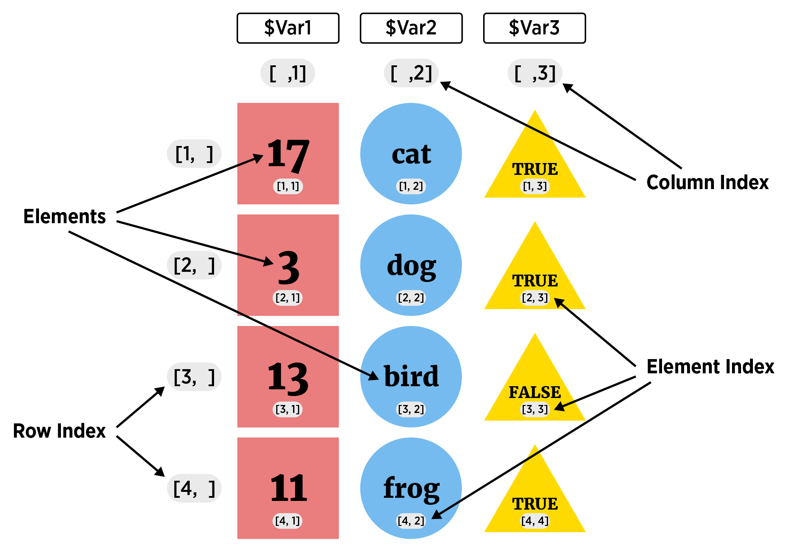
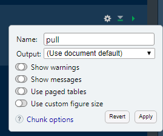
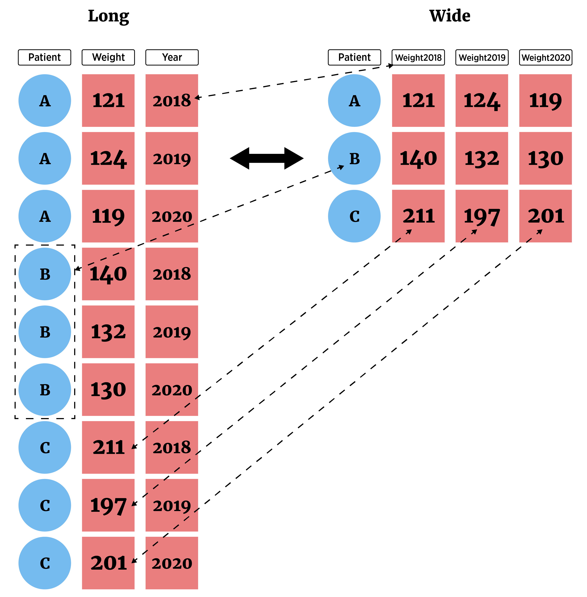

```{r setup, echo = FALSE, message = FALSE, warning = FALSE}
library(tidyverse)
library(knitr)
knitr::opts_chunk$set(echo = TRUE, eval = TRUE, message = FALSE, warning = FALSE)
```


## Workshop Intention

- Introduce data wrangling and visualization using packages from the `tidyverse`

    + `readr`, `dplyr`, `ggplot2`  
    
- Create reproducible work using `RMarkdown`  

- Be introduced to `RShiny`

    + Create interactive documents that run R on the backend
  
> - Only 4 total hours!  Not going in depth... but we will provide resources for continued learning!  


## Schedule 

- `RStudio` IDE (Integrated Development Environment)  

- Vectors and Data frames/Tibbles

- Importing CSV files with `readr`     

- Markdown basics  

- Common data manipulation with `dplyr`

- Plotting with `ggplot2`

- Shiny basics


## RStudio IDE 

In RStudio, four main 'areas'   

- Console (& Terminal)  

- Scripting and Viewing Window  
    
- Plots/Help (& Files/Packages)  

- Environment (& Connections/Git)  
    


## Console  

- Type code directly into the **console** for evaluation  

<div  style = "float: left; width = 45%;">
```{r calc2, echo=TRUE}
#simple math operations
# <-- is a comment - code not evaluated
3 + 7
10 * exp(3) #exp is exponential function
log(pi^2) #log is natural log by default
```
</div>

<div  style = "float: right; width = 45%;">
```{r basic, echo = TRUE, out.width = "400px", fig.align='center'}
mean(cars$speed)
hist(cars$speed)
```
</div>
<!--Output of each of these is actually a vector of length 1!-->

## Scripting and Viewing Window 

- Usually want to keep code for later use!  

> - Write code in a 'script' and save script (or use markdown - covered later)

> - From script can send code to console via: 
    <ul>
      <li> "Run" button (runs current line)  </li>
      <li> CTRL+Enter (PC) or Command+Enter (MAC)  </li>
      <li> Highlight section and do above</li>
    </ul>


## Plots/Help 

- Created plots stored in `Plots` tab  

    - Cycle through past plots  
    - Easily save  
 
- Type `help(...)` into the console for documentation  

    + `help(seq)`  
    + `help(data.frame)`  
 
## Environment   

- Store **data/info/function/etc.** in R objects  

- Create an R object via `<-` (recommended) or `=`  

```{r save,echo=TRUE}
#save for later
avg <- (5 + 7 + 6) / 3
#call avg object
avg
#strings (text) can be saved as well
words <- c("Hello there!", "How are you?")
words
```


## Environment   

- Look at all current objects with `ls()`

```{r ls, echo = TRUE}
ls()
```

- `rm()` to remove  

```{r rm, echo = TRUE}
rm(avg)
ls()
#rm(list = ls()) cleans up environment
```


## Environment   

- Built-in objects exist like `letters` and `cars`  

```{r builtin, echo = TRUE}
letters
head(cars, n = 3)
```

- `data()` shows available built-in datasets


## RStudio IDE 

Four main 'areas'   

- Console (& Terminal)  

- Scripting and Viewing Window  
    
- Plots/Help (& Files/Packages)  

- Environment (& Connections/Git)  
    
    
## Exercises

- Work through the part 1 exercises

<https://jbpost2.github.io/TeachingWithR/exercises/TeachingR_Part_1_Exercises.html>

- Introduce yourselves and get comfortable!  


#### Solution  

<https://jbpost2.github.io/TeachingWithR/exercises/TeachingR_Part_1_Solutions.html>


## R Objects and Structure  

- Create an R object via `<-` (recommended) or `=`  

    + allocates memory to object  
    
```{r create, echo = TRUE}
vec <- c(1, 4, 10)
vec
```

## R Objects and Structure  

- Create an R object via `<-` (recommended) or `=`  

    + allocates memory to object  
    
```{r create2, echo = TRUE}
fit <- lm(dist ~ speed, data = cars)
fit
```

## Investigating Objects  

Many functions to help understand an R Object  

 - `str()`  
 
 - compactly displays the internal structure of an R object  
 
```{r obj1, echo = TRUE}
str(cars)
```


## Data Objects   

- Understand data structures first: Five major types  

     1. Atomic Vector (1d)  
     2. ~~Matrix (2d)~~  
     3. ~~Array (nd)~~  
     4. Data Frame (2d)  
     5. ~~List (1d)~~  


Dimension | Homogeneous   | Heterogeneous
--------- | ------------- | -------------
1d        | Atomic Vector | List
2d        | Matrix        | Data Frame

## Vector   

1. Atomic Vector (1D group of elements with an ordering)   

```{r vectorVis, echo = FALSE, fig.align='center', out.width = '650px'}
knitr::include_graphics("../img/vectorVisualF.png")
```

- Elements must be same 'type'  

    + numeric (integer or double), character, or logical
    

## Vector   

1. Atomic Vector (1D group of elements with an ordering)   
  - Create with `c()` function ('combine')  
```{r vecs}
#vectors (1 dimensional) objects
x <- c(17, 22, 1, 3, -3)
y <- c("cat", "dog", "bird", "frog")
x
y
```


## Vector   

- Many functions output a numeric vector

```{r seq1}
v <- seq(from = 1, to = 10, by = 2)
v
1:10
```


## Vector   

1. Atomic Vector (1D group of elements with an ordering)   

- Vectors useful to know about  

- Not usually useful for a dataset 

- Often consider as 'building blocks' for other data types


## Data Frame    

<ol start="4">
  <li> Data Frame (2D data structure) </li>
</ol>  
- collection (list) of *vectors* of the same **length**  

```{r dfVis, echo = FALSE, out.width = "500px", fig.align= 'center'}

```


## Data Frame    

<ol start="4">
  <li> Data Frame (2D data structure) </li>
</ol>  
- collection (list) of *vectors* of the same **length**  

- Create with `data.frame()` function  

```{r df1,echo=TRUE}
x <- c("a", "b", "c", "d", "e", "f")
y <- c(1, 3, 4, -1, 5, 6)
z <- 10:15
data.frame(x, y, z)
```
<!--Like a more flexible matrix-->


## Data Frame    

<ol start="4">
  <li> Data Frame (2D data structure) </li>
</ol> 
- collection (list) of *vectors* of the same **length**  

- Create with `data.frame()` function

```{r df2,echo=TRUE,eval=TRUE}
data.frame(char = x, data1 = y, data2 = z)
```
- char, data1, and data2 become the variable names for the data frame
<!--Valid Name:  A syntactically valid name consists of letters, numbers and the dot or underline characters and starts with a letter or the dot not followed by a number. Names such as ".2way" are not valid and neither are the reserved words. "n1" is valid.

Reserved words: if else repeat while function for in next break TRUE FALSE NULL Inf NaN NA NA_integer_ NA_real_ NA_complex_ NA_character_

see ?make.names for more details-->


## Data Frame    

<ol start="4">
  <li> Data Frame (2D data structure) </li>
</ol> 
- collection (list) of *vectors* of the same **length**

- Create with `data.frame()` function

- Perfect for most data sets!  

- Most functions that read 2D data store it as a data frame  

- `Tibbles` are special data frames used in the `tidyverse`  


## Schedule 

- `RStudio` IDE (Integrated Development Environment)  

- Vectors and Data Frames/Tibbles

- Importing CSV files with `readr`    

- Markdown basics  

- Common data manipulation with `dplyr`

- Plotting with `ggplot2`

- Shiny basics


## Importing Data  
**How to read in data depends on raw/external data type!**  

- Delimited data  

     + Delimiter - Character (such as a `,`) that separates data entries

<div style = "float: left;border:1px solid black;">
<a href = "https://www4.stat.ncsu.edu/~online/datasets/neuralgia.csv">
```{r csv, fig.align = 'left', out.width = '205px', out.height = "249px", eval = TRUE, echo = FALSE}
knitr::include_graphics("../img/commaDelim.png")
```
</a>
</div>
<div style = "float: left;">
&nbsp;&nbsp;
</div>
<div style = "float: left;border:1px solid black;">
<a href = "https://www4.stat.ncsu.edu/~online/datasets/chemical.txt">
```{r space, fig.align = 'left', out.width = '205px', out.height = "249px", eval = TRUE, echo = FALSE}
knitr::include_graphics("../img/spaceDelim.png")
```
</a>
</div>
<div style = "float: left;">
&nbsp;&nbsp;
</div>
<div style = "float: left;border:1px solid black;">
<a href = "https://www4.stat.ncsu.edu/~online/datasets/crabs.txt">
```{r tab, fig.align = 'left', out.width = '205px', out.height = "249px", eval = TRUE, echo = FALSE}
knitr::include_graphics("../img/tabDelim.png")
```
</a>
</div>
<div style = "float: left;">
&nbsp;&nbsp;
</div>
<div style = "float: left;border:1px solid black;">
<a href = "https://www4.stat.ncsu.edu/~online/datasets/umps2012.txt">
```{r general, fig.align = 'left', out.width = '205px', out.height = "249px", eval = TRUE, echo = FALSE}
knitr::include_graphics("../img/generalDelim.png")
```
</a>
</div>
<div style = "clear:both; font-size: 10pt;">
&nbsp;&nbsp;&nbsp;&nbsp;&nbsp;&nbsp;&nbsp;**Comma:** usually .csv &nbsp;&nbsp;&nbsp;&nbsp;&nbsp;&nbsp;&nbsp;&nbsp;&nbsp;&nbsp;&nbsp;&nbsp;&nbsp;&nbsp;&nbsp;&nbsp;&nbsp;&nbsp;&nbsp;&nbsp;&nbsp;&nbsp;&nbsp;&nbsp;&nbsp;&nbsp;&nbsp;&nbsp;
**Space:** usually .txt or .dat &nbsp;&nbsp;&nbsp;&nbsp;&nbsp;&nbsp;&nbsp;&nbsp;&nbsp;&nbsp;&nbsp;&nbsp;&nbsp;&nbsp;&nbsp;&nbsp;&nbsp;&nbsp;&nbsp;&nbsp;
**Tab:** usually .tsv or .txt  &nbsp;&nbsp;&nbsp;&nbsp;&nbsp;&nbsp;&nbsp;&nbsp;&nbsp;&nbsp;&nbsp;&nbsp;&nbsp;&nbsp;&nbsp;&nbsp;&nbsp;&nbsp;&nbsp;&nbsp;&nbsp;&nbsp;&nbsp;
**General:** usually .txt or .dat
</div>


## Importing Delimited Data

 - When you open R a few `packages` are loaded
 
> - R package  
    <ul>
      <li> Collection of functions/datasets/etc. in one place</li>  
      <li> Packages exist to do almost anything</li>  
      <li> [List of CRAN](https://cran.r-project.org/web/packages/available_packages_by_name.html) approved packages on R's website</li>  
      <li> Plenty of other packages on places like GitHub</li>
    </ul>


## Importing Delimited Data

 - When you open R a few `packages` are loaded
 
```{r loadR, fig.align = 'center', out.width = "250px", echo = FALSE}
include_graphics("../img/loadR.png")
```

 - `utils` package has *family* of `read.` functions ready for use!  
 

## Reading Delimited Data  

- Functions from `read.` family work well  

- Concerns:  

    + poor default function behavior
    
         * (formerly, prior to R 4.0) strings are read as `factors`  
         
         * row & column names can be troublesome
    
    + (Slightly) different behavior on different computers  
    
    + Want to have most of our functions we use 'feel' the same...
    
> - "[TidyVerse](http://tidyverse.org/)" - collection of R packages that share common philosophies and are designed to work together!  

## Aside: R Packages

- First time using a package  
    + Must install package (download files)  
    + Can use code or menus

```{r, eval = FALSE}
install.packages("readr")
```

```{r install2, out.width = "800px",echo=FALSE, fig.align='center'}
knitr::include_graphics("../img/packages.png")
```

<!--Can also install them from local sources and stuff like that but that isn't usually required unless you are behind a firewall of some kind that keeps R from accessing the internet.-->
    

## Aside: R Packages

- Only install once!  

- **Each session**: read in package using `library()` or `require()`

```{r libreq1}
library("readr")
```


## Aside: R Packages  

- Hopefully you've already installed the `tidyverse` package via:  

```{r tidy, eval=FALSE}
install.packages("tidyverse")
```


## Aside: R Packages  

- Hopefully you've already installed the `tidyverse` package via:  

```{r tidy2, eval=FALSE}
install.packages("tidyverse")
```

- Now you can load the library  

```{r loadTidy, message = TRUE}
library(tidyverse)
```

- Once library loaded, check `help(filter)`  

<!--Note: There are two conflicts.  This just means functions that are named the same thing.  R uses the most recently loaded function and "masks" the old ones.  You can access specific package functions using "::" for instance, stats::filter(...) will call the filter function that has been masked.-->


## Aside: R Packages  

- Can call functions without loading full library with `::`  

- If not specified, most recently loaded package takes precedent

```{r readCSVex, eval = TRUE}
#stats::filter(...) calls time-series function from stats package
dplyr::filter(iris, Species == "virginica")
```

## Reading Delimited Data  

`baseR` and `tidyverse` (`readr` package does the heavy lifting) function and purpose:

Type of Delimeter           | `utils` Function        | `readr` Function 
--------------------------- | ----------------------- | ---------
Comma                       | `read.csv()`            | `read_csv()`
Semicolon (`,` for decimal) | `read.csv2()`           | `read_csv2()`
Tab                         | `read.delim()`          | `read_tsv()`
General                     | `read.table(sep = "")`  | `read_delim()`
White Space                 | `read.table(sep = "")`  | `read_table()` `read_table2()`


## Reading a .csv File  

- Let's read in the '[neuralgia.csv](https://www4.stat.ncsu.edu/~online/datasets/neuralgia.csv)' file  

- By default, R looks in the `working directory` for the file

```{r}
getwd()
#change with setwd()
#better to use R projects!
```


## Reading a .csv File  

- Let's read in the '[neuralgia.csv](https://www4.stat.ncsu.edu/~online/datasets/neuralgia.csv)' file  

```{r, eval = FALSE}
neuralgiaData <- read_csv("neuralgia.csv")
```

- R can pull from URLs as well!

```{r readCSV2, eval = TRUE}
neuralgiaData <- read_csv("https://www4.stat.ncsu.edu/~online/datasets/neuralgia.csv")
neuralgiaData
```


## Reading a .csv File  

`read_csv()` function 

- Other useful inputs:
    
    + `skip = 0`  
    + `col_names = TRUE`  
    + `na = c("", "NA")`  


## Reading Delimited Data  

- May have noticed the fancy printing of the data!  

- Checking column type is a basic data validation step  

- `tidyverse` data frames are called `tibbles`  

```{r class}
str(neuralgiaData)
```


## `tibbles`  

- Behavior slightly different than a standard `data frame`  

- Use either `pull()` or `$` to return a column as a vector

```{r pull}
pull(neuralgiaData, 1) #or pull(neuralgiaData, Treatment)
neuralgiaData$Treatment 
```

## Exercises

- Work through the part 2 exercises

<https://jbpost2.github.io/TeachingWithR/exercises/TeachingR_Part_2_Exercises.html>

#### Solution

<https://jbpost2.github.io/TeachingWithR/exercises/TeachingR_Part_2_Solutions.html>


## Schedule 

- `RStudio` IDE (Integrated Development Environment)  

- Vectors and Data Frames/Tibbles

- Importing CSV files with `readr`  

- Markdown basics  

- Common data manipulation with `dplyr`

- Plotting with `ggplot2`

- Shiny basics


## Data manipulation idea  

We may want to subset our full data set or create new data   

- Grab only certain types of observations (**filter rows**)

```{r, echo = FALSE, fig.align='center', out.width = "500px"}
knitr::include_graphics("../img/filterVisualF.png")
```


## Data manipulation idea  

We may want to subset our full data set or create new data   

- Look at only certain variables (**select columns**)  
    
```{r, echo = FALSE, fig.align='center', out.width = "400px"}
knitr::include_graphics("../img/selectVisualF.png")
```


## Data manipulation idea  

We may want to subset our full data set or create new data   

- Create new variables

```{r, echo = FALSE, fig.align='center', out.width = "520px"}
knitr::include_graphics("../img/createVarVisualF.png")
```


## Data manipulation idea  

We may want to subset our full data set or create new data   

> - Communication and reproducibility vital!  

> - Traditional documentation through comments (`#` in R) in script

> - May have heard of [JUPYTER](http://jupyter.org/) notebooks  

> - R Markdown - built in notebook for RStudio  


## Documenting with Markdown  


- R Markdown = Digital "Notebook":  Program that weaves word processing and code.  

- Designed to be used in three ways (R for Data Science)  


## Documenting with Markdown  


- R Markdown = Digital "Notebook":  Program that weaves word processing and code.  

- Designed to be used in three ways (R for Data Science)  
<ul>
  <li>Communicating to decision makers (focus on conclusions not code)</li>
  <li>Collaborating with other data scientists (including future you!)  </li>
  <li> As environment to do data science (documents what you did and what you were thinking)</li>
</ul>


## Documenting with Markdown  
**Verbage**

- May have heard of HTML (HyperText Mark-up Language)  
    + Write plain text that the browser interprets and renders  
    
    
## Documenting with Markdown  
**Verbage**

- May have heard of HTML (HyperText Mark-up Language)  
    + Write plain text that the browser interprets and renders  
    
- Markdown is a specific markup language  
    + Easier syntax  
    + Not as powerful  
    
> - White space is important!  

> - Any plain text file can be used (.Rmd extension associates it with RStudio)


## Documenting with Markdown  

R Markdown file contains three important types of content:

1. (Optional) YAML header surrounded by `---`s  

2. Chunks of R code   

3. Text mixed with simple text formatting instructions 


## Documenting with Markdown  
**Creating an R Markdown Document**

- RStudio makes it easy!  

```{r startMD.png, out.width = "700px",echo=FALSE, fig.align='center'}
knitr::include_graphics("../img/startMD.png")
```


## Documenting with Markdown  
**Creating an R Markdown Document**

- Commonly used document types can be created 

<div style="float: center;">
```{r startMDDoc.png, out.width = "500px",echo=FALSE, fig.align='center'}
knitr::include_graphics("../img/startMDDoc.png")
```
</div>


## Documenting with Markdown  
**Creating an R Markdown Document**

- Slide presentations 

```{r startMDPres.png, out.width = "500px",echo=FALSE, fig.align='center'}
knitr::include_graphics("../img/startMDPres.png")
```


## Documenting with Markdown  
**Creating an R Markdown Document**

- Truly Interactive Documents/Pages (require R backend)

```{r startMDShiny.png, out.width = "500px",echo=FALSE, fig.align='center'}
knitr::include_graphics("../img/startMDShiny.png")
```


## Documenting with Markdown  
**YAML Header**  

 - Define settings for document  

```
---
title: "Untitled"
author: "First Last"
date: "xxxx"
output: html_document
---
```  

- CTRL/CMD + Shift + k **knits** via this info 

     
## Documenting with Markdown  
**Code Chunks**  

 - Below YAML header: 'r chunk'  

```{r chunk_png, out.width = "500px",echo=FALSE, fig.align='center'}
knitr::include_graphics("../img/chunk.png")
```  

> - Start code chunk by typing ```{r} out or with CTRL/CMD + Alt/Option + I

> - Run and rerun code until you are happy  

> - Code will be executed when document is created    


## Documenting with Markdown  
**Markdown Syntax**
     
- Below code chunk is plain text with markdown sytnax  

```
## R Markdown

This is an R Markdown document. Markdown is a simple formatting syntax
for authoring HTML, PDF, and MS Word documents. For more details on
using R Markdown see <http://rmarkdown.rstudio.com>.

When you click the **Knit** button a document will be generated that
includes both content as well as the output of any embedded R code
chunks within the document. 
```

- When file created, "##" becomes a header, "<...>" a link, and ```**Knit**``` bold font


## Documenting with Markdown  

### R Markdown

This is an R Markdown document. Markdown is a simple formatting syntax
for authoring HTML, PDF, and MS Word documents. For more details on
using R Markdown see <http://rmarkdown.rstudio.com>.

When you click the **Knit** button a document will be generated that
includes both content as well as the output of any embedded R code
chunks within the document. 


## Where do we go from here?  

Briefly investigate:  

- Markdown syntax  

- Code chunks and their options  

- Changing type of output  


## Documenting with Markdown  

**Markdown syntax**  

- ```[Cheat Sheet link](https://www.rstudio.com/wp-content/uploads/2015/03/rmarkdown-reference.pdf)``` becomes [Cheat Sheet link](https://www.rstudio.com/wp-content/uploads/2015/03/rmarkdown-reference.pdf)  


## Documenting with Markdown  

**Markdown syntax**  

- ```[Cheat Sheet link](https://www.rstudio.com/wp-content/uploads/2015/03/rmarkdown-reference.pdf)``` becomes [Cheat Sheet link](https://www.rstudio.com/wp-content/uploads/2015/03/rmarkdown-reference.pdf)  

- ```# Header 1``` becomes a large font header  

- ```## Header 2``` becomes a slightly smaller font header  

- Goes to 6 headers  

    + Use of headers can automatically create a Table of Contents!


## Documenting with Markdown  

**Markdown syntax**  

- ```[Cheat Sheet link](https://www.rstudio.com/wp-content/uploads/2015/03/rmarkdown-reference.pdf)``` becomes [Cheat Sheet link](https://www.rstudio.com/wp-content/uploads/2015/03/rmarkdown-reference.pdf)  

- ```# Header 1``` becomes a large font header  

- ```## Header 2``` becomes a slightly smaller font header  

- Goes to 6 headers  

    + Use of headers can automatically create a Table of Contents!

- ```**bold**``` **and** ```__bold__```

- \`code\` becomes `code`  


## Documenting with Markdown  

**Markdown syntax**  

- Can do lists.  Indent sub lists four spaces  

<div style = "float: left; width: 50%">
```
* unordered list  
* item 2  
    + sub-item 1  
    + sub-item 2  

1. ordered list  
2. item 2  
    + sub-item 1  
    + sub-item 2  
```  
</div>
<div style = "float: right; width: 50%">
* unordered list  
* item 2  
    + sub-item 1  
    + sub-item 2  

1. ordered list  
2. item 2  
    + sub-item 1  
    + sub-item 2  
</div>


## Documenting with Markdown  

**Code chunks and their options**  

- Any R code can go into the chunk  

- Chunks evaluate sequentially (can use output from prior chunk)

> - Code can be added in line:  Ex: The Iris dataset has `r length(iris$Sepal.Length)` observations  

> - Added by beginning with back-tick `r` and ending with a back-tick: Iris has \`r `length(iris$Sepal.Length)`\`  


## Documenting with Markdown  

**Code chunks and their options**  

- Can hide/show code with `echo = FALSE/TRUE`  

- Can choose if code is evaluated with `eval = TRUE/FALSE`   

- `message = TRUE/FALSE` and `warning = TRUE/FALSE` can turn on/off displaying messages/warnings   

```{r, fig.align='center', message = FALSE, out.width=275, echo = FALSE}

```


## Documenting with Markdown  

**Code chunks and their options**  

- Many options depending on chunk purpose!    

- Can hide/show code with `echo = FALSE/TRUE`  

- Can choose if code is evaluated with `eval = TRUE/FALSE`   

- `message = TRUE/FALSE` and `warning = TRUE/FALSE` can turn on/off displaying messages/warnings   

- Can set global options for all chunks  

```
opts_chunk$set(echo = FALSE, eval = TRUE, warning = FALSE)
```

- Allows for easy change of audience!  

## Documenting with Markdown  

**Changing type of output**  

R Markdown really flexible!  

```{r, echo = FALSE, fig.align='center'}
knitr::include_graphics("../img/compile.png")
```


## Documenting with Markdown  

**Changing type of output**  

Change output type in the YAML header:  

- Use CTRL/CMD + Shift + k or the Knit menu:

```{r knit, echo=FALSE, fig.align='center', out.width='150px'}
knitr::include_graphics("../img/knit.png")
```

> - Use code explicity:  
    `rmarkdown::render("file.Rmd", output_format = "word_document")`


## Documenting with Markdown  

**Changing type of output**  

For HTML & PDF can include Table of Contents with options    

```
output:
  html_document:
    toc: true
    toc_float: true
```


## Documenting with Markdown  

**Changing type of output**  

For HTML & PDF can include Table of Contents with options    

```
output:
  html_document:
    toc: true
    toc_float: true
```

For HTML another option is to make the code chunks hidden by default, but visible with a click:

```
output:
  html_document:
    code_folding: hide
```

## Documenting with Markdown  

**Changing type of output**  

HTML documents inherently interactive  

- Widgets can be included with appropriate **R package** 

```{r leafletP, echo = TRUE, eval = FALSE}
library(leaflet)
leaflet() %>%
  setView(174.764, -36.877, zoom = 16) %>% 
  addTiles() %>%
  addMarkers(174.764, -36.877, popup = "Maungawhau") 
```


## Documenting with Markdown  

**Changing type of output**  

```{r leafletE, echo = FALSE, eval = TRUE, fig.align='center'}
library(leaflet)
leaflet() %>%
  setView(174.764, -36.877, zoom = 16) %>% 
  addTiles() %>%
  addMarkers(174.764, -36.877, popup = "Maungawhau") 
```


## Documenting with Markdown  

**Changing type of output**  


- PDF  
    + Install MikTex and update its packages or install a smaller version using the `tinytex` package: `tinytex::install_tinytex()`  
```
output: pdf_document   
```
  

## Documenting with Markdown  

**Changing type of output**  

- PDF  
    + Install MikTex and update its packages or install a smaller version using the `tinytex` package: `tinytex::install_tinytex()`  
```
output: pdf_document   
```

- Word  
```
output: word_document
```

## Documenting with Markdown  

**Changing type of output**  

- PDF  
    + Install MikTex and update its packages or install a smaller version using the `tinytex` package: `tinytex::install_tinytex()`  
```
output: pdf_document   
```

- Word  
```
output: word_document
```

 - Slides (## for new slide)
```
output: ioslidespresentation
```


## Exercises

- Work through the part 3 exercises

<https://jbpost2.github.io/TeachingWithR/exercises/TeachingR_Part_3_Exercises.html>

#### Partial Solution

<https://jbpost2.github.io/TeachingWithR/exercises/TeachingR_Part_3_Solutions.html>


## `tidyverse` for data manipulations

Now we can document everything: let's manipulate some data!  

**Overview of dplyr and tidyr packages**

- `dplyr` package made for most standard data manipulation tasks    

- `tidyr` package reshapes data  

- Both part of `tidyverse`  

- Make sure `library(tidyverse)` has been run!  
 

## Tidyverse Syntax

- Reason to prefer `dplyr` and packages from the `tidyverse` 

> - Good defaults

> - All packages have similar syntax!  All work on `tibbles` (data frames)

> - Syntax:
`function(tibble, actions, ...)`


## `dplyr` 

- Basic commands 
    + `as_tibble()` - convert data frame to one with better printing  
    + `filter()` - subset **rows**  
    + `arrange()` - reorder **rows**  
    + `select()` - subset **columns**  
    + `rename()` - rename **columns**  
    + `mutate()` - add newly created **column**  
    + `transmute()` - create new variable  
    + `group_by()` - group **rows** by a variable   
    + `summarise()` - apply basic function to data  


## `as_tibble()` - tidy data frame 

`as_tibble()` - convert data frame to one with better printing and no simplification

```{r,eval=TRUE}
#install.packages("Lahman")
library(Lahman)
head(Batting, n = 4) #look at just first 4 observations
```

## `as_tibble()` - tidy data frame 

- Just 'wrap' a standard R data frame

```{r,eval=TRUE}
myBatting <- as_tibble(Batting); myBatting
```


## `filter()` - subset rows or columns  

- Grab only certain types of observations (**filter rows**)

```{r, echo = FALSE, fig.align='center', out.width = "500px"}
knitr::include_graphics("../img/filterVisualF.png")
```


## Logical statements 

Goal: Subset rows or columns  

- **logical statement** - comparison that resolves as `TRUE` or `FALSE`  

<div style="float: left; width: 45%;">
```{r}
"hi" == " hi" #== is comparison
"hi" == "hi"
4 >= 1
```
</div>
<div style="float: right; width: 45%;">
```{r}
4 != 1
sqrt(3)^2  == 3
dplyr::near(sqrt(3)^2, 3)
```
</div>


## Logical statements 

Goal: Subset rows or columns  

- **logical statement** - comparison that resolves as `TRUE` or `FALSE`  

<div style="float: left; width: 45%;">
```{r}
#use of is. functions
is.numeric("Word")
is.numeric(10)
```
</div>
<div style="float: right; width: 45%;">
```{r}
is.character("10")
is.na(c(1:2, NA, 3))
is.matrix(c("hello", "world"))
```
</div>


## Logical statements 

Goal: Subset rows or columns  

- **logical statement** - useful for indexing an R object

- Syntax: `filter(tibble, vector-of-TRUE-FALSE)`     
    + R returns elements where `TRUE` 

```{r}
myBatting$G > 20 #vector indicating Games > 20
```


## `filter()` - subset rows or columns  

- **logical statement** - useful for indexing an R object

```{r}
filter(myBatting, G > 20)
```


## Logical statements 

Compound logicals via **Logical Operators**

- `&` 'and'
- `|` 'or'

Operator | A,B true       | A true, B false   | A,B false
---------|----------------|-------------------|--------------
`&`      | `A & B = TRUE` | `A & B = FALSE`   | `A & B = FALSE`
`|`      | `A | B = TRUE` | `A | B = TRUE`    | `A | B = FALSE`


## Logical statements 

- Pull out those that played more than 20 games and played in 2015

```{r}
(myBatting$G > 20) & (myBatting$yearID == 2015)
```


## `filter()` - subset rows or columns  

- Pull out those that played more than 20 games and played in 2015

```{r}
filter(myBatting, (G > 20) & (yearID == 2015))
```


## `arrange()` - reorder **rows**

- Syntax: `arrange(tibble, column1, column2, ...)`  

```{r}
#reorder by teamID
arrange(myBatting, teamID)
```


## `arrange()` - reorder **rows**

```{r}
#get secondary arrangement as well
arrange(myBatting, teamID, G)
```


## `arrange()` - reorder **rows**

```{r}
#descending instead
arrange(myBatting, teamID, desc(G))
```


## Data manipulation idea  

We may want to subset our full data set or create new data   

- Look at only certain variables (**select columns**)  
    
```{r, echo = FALSE, fig.align='center', out.width = "400px"}
knitr::include_graphics("../img/selectVisualF.png")
```


## `select()` - subset **columns**

- May only want certain variables  
- `select(tibble, column1, column2,...)`  

```{r}
#Choose a single column by name
select(myBatting, X2B)
```


## `select()` - subset **columns**


```{r}
#Choose more than one column by name
select(myBatting, playerID, X2B)
```


## Aside: Piping or Chaining

- Applying multiple functions: nesting hard to parse!
- Piping or Chaining with `%>%` operator helps

```{r}
arrange(select(filter(myBatting, teamID == "PIT"), playerID, G, X2B), desc(X2B))
```


## Aside: Piping or Chaining

- Applying multiple functions: nesting hard to parse!
- Piping or Chaining with `%>%` operator helps

```{r}
myBatting %>% 
  filter(teamID == "PIT") %>% 
  select(playerID, G, X2B) %>% 
  arrange(desc(X2B)) 
```


## Aside: Piping or Chaining

- Generically, pipe does the following

`x %>% f(y)` turns into `f(x,y)`  

`x %>% f(y) %>% g(z)` turns into `g(f(x, y), z)`  

- Can be used with functions outside the tidyverse if this structure works!    


## `select()` - subset **columns**

- Great functionality for choosing variables  

```{r}
#all columns between
myBatting %>% 
  select(X2B:HR)
```


## `select()` - subset **columns**

- Great functionality for choosing variables  

```{r}
#all columns containing
myBatting %>% 
  select(contains("X"))
```


## `select()` - subset **columns**

- Great functionality for choosing variables  

```{r}
#all columns starting with
myBatting %>% 
  select(starts_with("X"))
```


## `select()` - subset **columns**

- Great functionality for choosing variables  

```{r}
#multiple selections
myBatting %>% 
  select(starts_with("X"), ends_with("ID"), G)
```


## `select()` - subset **columns**

- Can reorder variables

```{r}
#reorder
myBatting %>% 
  select(playerID, HR, everything())
```


## `rename()` - rename variables

- Syntax: `rename(tibble, "new-name" = column, ...)`  

```{r}
#rename our previous
myBatting %>% 
  select(starts_with("X"), ends_with("ID"), G) %>% 
  rename("Doubles" = X2B, "Triples" = X3B)
```


## `dplyr`

[Cheat sheet](https://www.rstudio.com/wp-content/uploads/2015/02/data-wrangling-cheatsheet.pdf)

- Common syntax and piping make code easy to use and read   

- Basic commands 
    + `as_tibble()` - convert data frame to one with better printing
    + `filter()` - subset **rows**
    + `arrange()` - reorder **rows**
    + `select()` - subset **columns**

- Many `joins` to combine tibbles too! (Similar to SQL)


## Data manipulation idea  

- Create new variables

```{r, echo = FALSE, fig.align='center', out.width = "500px"}
knitr::include_graphics("../img/createVarVisualF.png")
```


## Creating New Variables  

- `mutate()` - add newly created **column(s)** to current data frame (doesn't overwrite the data frame)  

- `transmute()` - create new data frame with created variable(s) only  

- Syntax:  

`mutate(data, newVarName = functionOfData, newVarName2 = functionOfData, ...)`  


## Creating New Variables  

- Consider a data set on movie ratings  

```{r,eval=TRUE}
library(fivethirtyeight)
fandango
```


## `mutate()` - create new column(s)

```{r}
##Create an average rottentomatoes score variable
fandango %>% 
  mutate(avgRotten = (rottentomatoes + rottentomatoes_user)/2)
```


## `mutate()` - create new column(s)

```{r}
#can't see it!
fandango %>% 
  mutate(avgRotten = (rottentomatoes + rottentomatoes_user)/2) %>% 
  select(film, year, avgRotten, everything())
```


## `mutate()` - create new column(s)

- Add more than one variable

```{r}
fandango %>% 
  mutate(avgRotten = (rottentomatoes + rottentomatoes_user)/2, 
         avgMeta = (metacritic_norm + metacritic_user_nom)/2) %>%
  select(film, year, avgRotten, avgMeta, everything())
```


## Creating New Variables  

`mutate()` and `transmute()` can also use some statistical functions
 
```{r}
fandango %>% 
  select(rottentomatoes) %>% 
  mutate(avg = mean(rottentomatoes), sd = sd(rottentomatoes))
```

## Creating New Variables  

`mutate()` and `transmute()` can also use some statistical functions
 
- `group_by` to create summaries for groups  
 
```{r}
fandango %>% 
  select(year, rottentomatoes) %>% 
  group_by(year) %>% 
  mutate(avg = mean(rottentomatoes), sd = sd(rottentomatoes))
```


## Other notes: Summarizing with `dplyr`  

- `summarize()` is often used with `group_by()` to obtain summaries without adding to the dataset  

```{r}
fandango %>% 
  select(year, rottentomatoes) %>% 
  group_by(year) %>% 
  summarize(avg = mean(rottentomatoes), sd = sd(rottentomatoes))
```


## `if_else()` - conditional execution 

- Often want to execute statements conditionally to create a variable

- `if_else()` syntax:

    + `if_else(condition, true, false)`  
    + `condition` is a vector of TRUE/FALSE  
    + `true` is what to do when TRUE occurs  
    + `false` is what to do when FALSE occurs

- Works well with `mutate()`


## Creating New Variables  
**Conditional Execution with If then, If then else**

- Consider built-in data set `airquality`  

    + daily air quality measurements in New York  
    
    + from May (Day 1) to September (Day 153) in 1973  

```{r}
myAirquality <- as_tibble(airquality)
myAirquality
```

## `if_else()` with `mutate()`

```{r}
myAirquality <- myAirquality %>% 
  mutate(Status = if_else(Wind >= 15, "HighWind",
                          if_else(Wind >= 10, "Windy",
                                  if_else(Wind >= 6, "LightWind", "Calm"))))
myAirquality
```


## Creating New Variables Recap!

- `mutate()` - add newly created **column(s)** to current data frame 

- `transmute()` - create new data frame with created variable(s)  

    + Use `if_else()` to do conditional creation
    
    + Note: `cut()` can be used to categorize a numeric variable!


## Other notes: Reshaping Data  

Long vs Wide format data

```{r, out.width="450px", echo = FALSE, fig.align='center'}

```

## Other notes: Reshaping Data  

### `tidyr` package

Easily allows for two very important actions

> - `pivot_longer()` - lengthens data by increasing the number of rows and decreasing the number of columns    
    <ul>  
        <li> Most important as analysis methods often prefer this form</li>  
    </ul>  
         
> - `pivot_wider()` - widens data by increasing the number of columns and decreasing the number of rows  

> - Also, `unite()` and `separate()` to join and split columns

>- All functions work with tibbles and have a similar syntax/philosophy  

## Exercises  

- Work through the part 4 exercises


<https://jbpost2.github.io/TeachingWithR/exercises/TeachingR_Part_4_Exercises.html>

#### Partial Solution

<https://jbpost2.github.io/TeachingWithR/exercises/TeachingR_Part_4_Solutions.html>


## Schedule 

- `RStudio` IDE (Integrated Development Environment)  

- Vectors and Data Frames/Tibbles

- Importing CSV files with `readr`    

- Markdown basics  

- Common data manipulation with `dplyr`

- Plotting with `ggplot2`

- Shiny basics


## Graphical Summaries

Three major systems for plotting:

- Base R (built-in functions)  

- Lattice 

- ggplot2 (sort of part of the tidyverse - [Cheat Sheet](https://www.google.com/url?sa=t&rct=j&q=&esrc=s&source=web&cd=2&cad=rja&uact=8&ved=2ahUKEwjFu_ep-rroAhXnknIEHf13Bq4QFjABegQICBAB&url=https%3A%2F%2Frstudio.com%2Fwp-content%2Fuploads%2F2016%2F11%2Fggplot2-cheatsheet-2.1.pdf&usg=AOvVaw1-6jSR5VfWs7V62OYxtDtG))

    + `ggplot(data = data_frame)` creates a plot instance  
    + Add "layers" to the system (geoms or stats)  

Great [reference book here!](https://bookdown.org/rdpeng/exdata/plotting-systems.html)


## `ggplot2` Plotting

ggplot2 basics ([Cheat Sheet](https://www.google.com/url?sa=t&rct=j&q=&esrc=s&source=web&cd=2&cad=rja&uact=8&ved=2ahUKEwjFu_ep-rroAhXnknIEHf13Bq4QFjABegQICBAB&url=https%3A%2F%2Frstudio.com%2Fwp-content%2Fuploads%2F2016%2F11%2Fggplot2-cheatsheet-2.1.pdf&usg=AOvVaw1-6jSR5VfWs7V62OYxtDtG))

- `ggplot(data = data_frame)` creates a plot instance  
- Add "layers" to the system (geoms or stats)  
    + Creates a visualization of the data  
    
    

## `ggplot2` Plotting

ggplot2 basics ([Cheat Sheet](https://www.google.com/url?sa=t&rct=j&q=&esrc=s&source=web&cd=2&cad=rja&uact=8&ved=2ahUKEwjFu_ep-rroAhXnknIEHf13Bq4QFjABegQICBAB&url=https%3A%2F%2Frstudio.com%2Fwp-content%2Fuploads%2F2016%2F11%2Fggplot2-cheatsheet-2.1.pdf&usg=AOvVaw1-6jSR5VfWs7V62OYxtDtG))

- `ggplot(data = data_frame)` creates a plot instance  
- Add "layers" to the system (geoms or stats)  
    + Creates a visualization of the data  
- Modify layer "mapping" args (aes)
    + Ex: size, color, and x, y location(s)  
- Coordinate system (mostly use Cartesian plane)  
- Optional: Titles, etc.


## `factors`  

- factor - special class of vector with a `levels` attribute  

> - Levels define all possible values for that variable  
    <ul>
      <li> Great for variable like `Day` (Monday, Tuesday, ...)</li>
      <li> Not great for variable like `Name` where new values may come up</li>  
    </ul>

> - Quite useful with plotting
    <ul>
      <li> Allows for easy labeling of subgroups</li>
    </ul>

## `factors`

- Consider data on titanic passengers in `titanic.csv`

```{r,echo=TRUE}
titanicData <- read_csv("titanic.csv")
#convert survival status to a factor
titanicData$survived <- as.factor(titanicData$survived)
levels(titanicData$survived) #R knows it isn't numeric now
```

- Can't add value unless it is a level

```{r, error=TRUE, error = TRUE, message = TRUE, warning=TRUE}
titanicData$survived[1] <- "5"
```


## `factor` levels

- Useful if you want to create better labels (or change the ordering)  

```{r reread,echo = TRUE}
levels(titanicData$survived) <- c("Died", "Survived")
levels(titanicData$survived)
```


## `ggplot2` Plotting: Categorical variables  

Categorical variable - entries are a label or attribute   

Generally, describe distriubtion using a barplot!

- Barplots via `ggplot + geom_bar`  

```{r,echo=TRUE}
titanicData <- read_csv("titanic.csv")
titanicData$mySurvived <- as.factor(titanicData$survived)
levels(titanicData$mySurvived) <- c("Died", "Survived")
titanicData$myEmbarked <- as.factor(titanicData$embarked)
levels(titanicData$myEmbarked) <- c("Cherbourg", "Queenstown", "Southampton")
titanicData <- titanicData %>% drop_na(mySurvived, sex, myEmbarked)
```


## `ggplot2` barplots  

- Barplots via `ggplot + geom_bar`  

- Across x-axis we want our categories - specify with `aes(x = ...)`

```{r, eval=TRUE, out.width = "450px", fig.align='center'}
ggplot(data = titanicData, aes(x = mySurvived))
```


## `ggplot2` barplots  

- Barplots via `ggplot + geom_bar`  

- Must add geom (or stat) layer!

```{r,eval=TRUE, out.width = "450px", fig.align='center'}
ggplot(data = titanicData, aes(x = mySurvived)) + geom_bar()
```


## `ggplot2` barplots  

- Generally: Save base object, then "add layers"  

```{r,eval = FALSE, out.width = "450px", fig.align='center'}
g <- ggplot(data = titanicData, aes(x = mySurvived))
g + geom_bar()
```


## `ggplot2` barplots  

- Generally: Save base object, then "add layers"  

```{r,eval = FALSE, out.width = "450px", fig.align='center'}
g <- ggplot(data = titanicData, aes(x = mySurvived))
g + geom_bar()
```

- `aes()` defines visual properties of objects in the plot  

&nbsp; &nbsp; &nbsp; &nbsp; `x = , y = , size = , shape = , color = , alpha = , ...` 

-  [Cheat Sheet](https://www.google.com/url?sa=t&rct=j&q=&esrc=s&source=web&cd=2&cad=rja&uact=8&ved=2ahUKEwjFu_ep-rroAhXnknIEHf13Bq4QFjABegQICBAB&url=https%3A%2F%2Frstudio.com%2Fwp-content%2Fuploads%2F2016%2F11%2Fggplot2-cheatsheet-2.1.pdf&usg=AOvVaw1-6jSR5VfWs7V62OYxtDtG) gives most common properties for a given `geom`  


## `ggplot2` barplots  

- Generally: Save base object, then "add layers"  

```{r,eval = FALSE, out.width = "450px", fig.align='center'}
g <- ggplot(data = titanicData, aes(x = mySurvived))
g + geom_bar()
```

- `aes()` defines visual properties of objects in the plot  

&nbsp; &nbsp; &nbsp; &nbsp; `x = , y = , size = , shape = , color = , alpha = , ...`

-  [Cheat Sheet](https://www.google.com/url?sa=t&rct=j&q=&esrc=s&source=web&cd=2&cad=rja&uact=8&ved=2ahUKEwjFu_ep-rroAhXnknIEHf13Bq4QFjABegQICBAB&url=https%3A%2F%2Frstudio.com%2Fwp-content%2Fuploads%2F2016%2F11%2Fggplot2-cheatsheet-2.1.pdf&usg=AOvVaw1-6jSR5VfWs7V62OYxtDtG) gives most common properties for a given `geom`  

&nbsp; &nbsp; &nbsp; &nbsp; `d + geom_bar()`  

&nbsp; &nbsp; &nbsp; &nbsp; `x, alpha, color, fill, linetype, size, weight`
    


## `ggplot2` global and local aesthetics  
 
`data` and `aes` can be set in two ways;

- 'globally' (for all layers) via the `ggplot` statement  

- 'locally' (for just that layer) via the `geom`, `stat`, etc. layer


## `ggplot2` global and local aesthetics  
 
`data` and `aes` can be set in two ways;

- 'globally' (for all layers) via the `ggplot` statement  

- 'locally' (for just that layer) via the `geom`, `stat`, etc. layer

```{r,eval = FALSE, out.width = "450px", fig.align='center'}
#global 
ggplot(data = titanicData, aes(x = mySurvived)) + geom_bar()
#local 
ggplot() + geom_bar(data = titanicData, aes(x = mySurvived))
```


## `ggplot2` global and local aesthetics  
 
`data` and `aes` can be set in two ways;

- 'globally' (for all layers) via the `ggplot` statement  

- 'locally' (for just that layer) via the `geom`, `stat`, etc. layer

```{r,eval = FALSE, out.width = "450px", fig.align='center'}
#global 
ggplot(data = titanicData, aes(x = mySurvived)) + geom_bar()
#local 
ggplot() + geom_bar(data = titanicData, aes(x = mySurvived))
```

- To set an attribute that doesn't depend on the data (i.e. `color = 'blue'`), generally place these outside of the `aes`  

## `ggplot2` barplots

- Add better labels and a title (new layers, see cheat sheet!)  

```{r,eval = TRUE, out.width = "450px", fig.align='center'}
ggplot(data = titanicData, aes(x = mySurvived)) + 
  geom_bar() + 
  labs(x = "Survival Status", title = "Bar Plot of Survival for Titanic Passengers")
```


## `ggplot2` stacked barplots

- **Stacked barplot** created by via `fill` aesthetic and same process
    
    + Create base object  
    + Add geoms  
    + Use aes to specify aspects of the plot  


     
## `ggplot2` stacked barplots
 
- **Stacked barplot** created by via `fill` aesthetic

- Automatic assignment of colors, creation of legends, etc. for `aes` elements (except with `group`)

```{r,eval = TRUE, out.width = "450px", fig.align='center'}
ggplot(data = titanicData, aes(x = mySurvived, fill = sex)) + geom_bar()
```


## `ggplot2` labeling

- Add custom labels by adding more layers

```{r,eval = TRUE, out.width = "450px", fig.align='center'}
ggplot(data = titanicData, aes(x = mySurvived, fill = sex)) + 
  geom_bar() +
  labs(x = "Survival Status", 
       title = "Bar Plot of Survival Status for Titanic Passengers") +
  scale_fill_discrete(name = "Sex", labels = c("Female", "Male"))
```


## `ggplot2` labeling

- Adjusting appropriate labeling via `scale_*_discrete`


`aes(x = survived, fill = sex)` 

`scale_x_discrete(labels = c("Person Died", "Person Survived"))`

`scale_fill_discrete(name = "Sex", labels = c("Female","Male"))`


## `ggplot2`  horizontal barplots  

- Easy to rotate a plot with `coord_flip`  

```{r,eval = TRUE, out.width = "450px", fig.align='center'}
ggplot(data = titanicData, aes(x = mySurvived, fill = sex)) + geom_bar() +
  labs(x = "Survival Status", 
       title = "Bar Plot of Survival Status for Titanic Passengers") + 
  scale_x_discrete(labels = c("Person Died", "Person Survived")) + 
  scale_fill_discrete(name = "Sex", labels = c("Female", "Male")) + 
  coord_flip()
```


## `ggplot2` side-by-side barplots

- **Side-by-side barplot** created by via `position` aesthetic

    + `dodge` for side-by-side bar plot  
    + `jitter` for continuous data with many points at same values  
    + `fill` stacks bars and standardises each stack to have constant height  
    + `stack` stacks bars on top of each other


## `ggplot2` side-by-side barplots

- **Side-by-side barplot** created by via `position` aesthetic

```{r,eval = TRUE, out.width = "450px", fig.align='center'}
ggplot(data = titanicData, aes(x = mySurvived, fill = sex)) + 
  geom_bar(position = "dodge")
```


## `ggplot2` filled barplots
  
 - `position = fill` stacks bars and standardises each stack to have constant height (especially useful with equal group sizes)  

```{r,eval = TRUE, out.width = "450px", fig.align='center'}
ggplot(data = titanicData, aes(x = mySurvived, fill = sex)) + 
  geom_bar(position = "fill")
```


## `ggplot2` faceting  

How to create same plot for each `myEmbarked` value?  Use **faceting**!


## `ggplot2` faceting  

How to create same plot for each `myEmbarked` value?  Use **faceting**!

`facet_wrap(~ var)` - creates a plot for each setting of `var`  

- Can specify `nrow` and `ncol` or let R figure it out


## `ggplot2` faceting  

How to create same plot for each `myEmbarked` value?  Use **faceting**!

`facet_wrap(~ var)` - creates a plot for each setting of `var`  

- Can specify `nrow` and `ncol` or let R figure it out

`facet_grid(var1 ~ var2)` - creats a plot for each combination of `var1` and `var2`  

- `var1` values across rows

- `var2` values across columns

- Use `. ~ var2` or `var1 ~ .` to have only one row or column  


## `ggplot2` faceting  

How to create same plot for each `myEmbarked` value?  Use **faceting**!

- `facet_wrap(~ var)` - creates a plot for each setting of `var`  

```{r,eval = TRUE, out.width = "450px", fig.align='center'}
ggplot(data = titanicData, aes(x = mySurvived)) + 
  geom_bar(aes(fill =sex), position = "dodge") +
  facet_wrap(~ myEmbarked)
```


## `ggplot2` Plotting Recap

General `ggplot` things:

- Can set local or global `aes`

- Modify titles/labels by adding more layers

- Faceting (multiple plots) via `facet_grid` or `facet_wrap`

- Only need `aes` if setting a mapping value that is dependent on the data (or you want to create a custom legend!)  


## `ggplot2` Plotting: Numeric Variables    

Numeric variables - generally, describe distribution via a histogram or boxplot!  

Same process:
    
- Create base object  
- Add geoms  
- Use aes to specify aspects of the plot  


## `ggplot2` smoothed histogram    

- **Kernel Smoother** - Smoothed version of a histogram  

- Common `aes` values (from cheat sheet):

&nbsp; &nbsp; &nbsp; &nbsp; `c + geom_density(kernel = "gaussian")`  

&nbsp; &nbsp; &nbsp; &nbsp; `x, y, alpha, color, fill, group, linetype, size, weight`

> - Only `x =` is really needed


## `ggplot2` smoothed histogram    

- **Kernel Smoother** - Smoothed version of a histogram  

```{r, echo = TRUE, out.width = "500px", fig.align='center'}
g <- ggplot(titanicData, aes(x = age))
g + geom_density()
```


## `ggplot2` smoothed histogram    

- **Kernel Smoother** - Smoothed version of a histogram  

- `fill` a useful aesthetic! 

```{r, echo = TRUE, out.width = "500px", fig.align='center'}
g + geom_density(adjust = 0.5, alpha = 0.5, aes(fill = mySurvived))
```


## `ggplot2` smoothed histogram    

- **Kernel Smoother** - Smoothed version of a histogram  

- recall `position` choices of `dodge`, `jitter`, `fill`, and `stack`

```{r, echo = TRUE, out.width = "500px", fig.align='center'}
g + geom_density(adjust = 0.5, alpha = 0.5, position = "stack", aes(fill = mySurvived))
```


## `ggplot2` boxplots

- **Boxplot** - Provides the five number summary in a graph

- Common `aes` values (from cheat sheet):

&nbsp; &nbsp; &nbsp; &nbsp; `f + geom_boxplot()`

&nbsp; &nbsp; &nbsp; &nbsp; `x, y, lower, middle, upper, ymax, ymin, alpha, color, fill, group, linetype, shape, size, weight`

> - Only `x =, y =` are really needed  


## `ggplot2` boxplots

```{r, echo = TRUE, out.width = "500px", fig.align='center'}
g <- ggplot(titanicData, aes(x = mySurvived, y = age))
g + geom_boxplot(fill = "grey")
```


## `ggplot2` boxplots with points

- Can add data points (jittered) to see shape of data better (or use violin plot)

```{r, echo = TRUE, out.width = "500px", fig.align='center'}
g + 
  geom_boxplot(fill = "grey") +
  geom_jitter(width = 0.1, alpha = 0.3)
```


## `ggplot2` boxplots with points

- Order of layers important!

```{r, echo = TRUE, out.width = "500px", fig.align='center'}
g + 
  geom_jitter(width = 0.1, alpha = 0.3) + 
  geom_boxplot(fill = "grey")
```


## `ggplot2` faceting

- Can `facet` easily!

```{r, echo = TRUE, out.width = "500px", fig.align='center'}
g + geom_boxplot(fill = "grey") +
  geom_jitter(width = 0.1, alpha = 0.3) + 
  facet_wrap(~ myEmbarked)
```


## `ggplot2` Plotting: Numeric variables  

Recap!  

Numeric variable - entries are a numerical value where math can be performed

Most common plots:

- Histogram (`geom_hist`), Density (`geom_density`)  

- Boxplot (`geom_boxplot`), Violin plot (`geom_violin`)

- Scatter plot (`geom_point`), Smoothers (`geom_smooth`)

- Jittered points (`geom_jitter`)  

- Text on plot (`geom_text`)  


## `ggplot2` Plotting Recap

General `ggplot` things:

- Can set local or global `aes`

- Modify titles/labels by adding more layers

- Use either stat or geom layer

- Faceting (multiple plots) via `facet_grid` or `facet_wrap`

- Only need `aes` if setting a mapping value that is dependent on the data (or you want to create a custom legend!)  

> - `esquisse` is a [great package for exploring ggplot2](https://cran.r-project.org/web/packages/esquisse/vignettes/get-started.html)!

## Exercises

- Work through the part 5 exercises


<https://jbpost2.github.io/TeachingWithR/exercises/TeachingR_Part_5_Exercises.html>

#### Partial Solution

<https://jbpost2.github.io/TeachingWithR/exercises/TeachingR_Part_5_Solutions.html>


